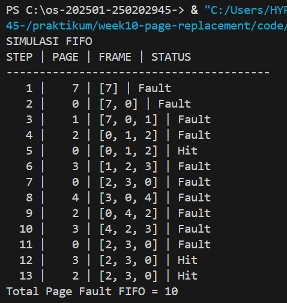
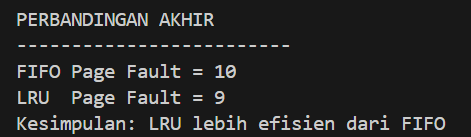

# Laporan Praktikum Minggu [10]
Topik: Manajemen Memori – Page Replacement (FIFO & LRU)

---

## Identitas
- **Nama**  : Latifah Risti Anggraeni  
- **NIM**   : 250202945
- **Kelas** : 1IKRB

---

## Tujuan
1. Mengimplementasikan algoritma page replacement FIFO dalam program.
2. Mengimplementasikan algoritma page replacement LRU dalam program.
3. Menjalankan simulasi page replacement dengan dataset tertentu.
4. Membandingkan performa FIFO dan LRU berdasarkan jumlah *page fault*.
5. Menyajikan hasil simulasi dalam laporan yang sistematis.

---

## Dasar Teori
1. Page Replacement adalah algoritma yang digunakan oleh sistem operasi untuk memutuskan halaman (page) mana yang harus dikeluarkan dari memori ketika halaman baru perlu dimuat sementara memori utama (RAM) sudah penuh.

2. FIFO (First-In-First-Out) merupakan algoritma paling sederhana. Halaman yang pertama kali masuk ke memori akan menjadi yang pertama diganti tanpa memperhatikan seberapa sering halaman tersebut diakses.

3. LRU (Least Recently Used) merupakan algoritma yang lebih adaptif. Mengganti halaman yang sudah paling lama tidak digunakan di masa lalu, dengan asumsi bahwa halaman yang jarang digunakan di masa lalu kemungkinan besar tidak akan digunakan lagi dalam waktu dekat.

---

## Langkah Praktikum
1. **Menyiapkan Dataset**

   Gunakan *reference string* berikut sebagai contoh:
   ```
   7, 0, 1, 2, 0, 3, 0, 4, 2, 3, 0, 3, 2
   ```
   Jumlah frame memori: **3 frame**.

2. **Implementasi FIFO**

   - Simulasikan penggantian halaman menggunakan algoritma FIFO.
   - Catat setiap *page hit* dan *page fault*.
   - Hitung total *page fault*.

3. **Implementasi LRU**

   - Simulasikan penggantian halaman menggunakan algoritma LRU.
   - Catat setiap *page hit* dan *page fault*.
   - Hitung total *page fault*.

4. **Eksekusi & Validasi**

   - Jalankan program untuk FIFO dan LRU.
   - Pastikan hasil simulasi logis dan konsisten.
   - Simpan screenshot hasil eksekusi.

5. **Analisis Perbandingan**

   Buat tabel perbandingan seperti berikut:

   | Algoritma | Jumlah Page Fault | Keterangan |
   |:--|:--:|:--|
   | FIFO | ... | ... |
   | LRU | ... | ... |


   - Jelaskan mengapa jumlah *page fault* bisa berbeda.
   - Analisis algoritma mana yang lebih efisien dan alasannya.

6. **Commit & Push**

   ```bash
   git add .
   git commit -m "Minggu 10 - Page Replacement FIFO & LRU"
   git push origin main
   ```


---

## Kode / Perintah
 ```
   7, 0, 1, 2, 0, 3, 0, 4, 2, 3, 0, 3, 2
   ```
   Jumlah frame memori: **3 frame**.

---

## Hasil Eksekusi




---

## Analisis
Berdasarkan hasil simulasi dengan reference string `7, 0, 1, 2, 0, 3, 0, 4, 2, 3, 0, 3, 2`:
1. FIFO menghasilkan 15 Page Fault. Hal ini terjadi karena FIFO bersifat kaku. Meskipun halaman 0 sering digunakan, FIFO akan tetap mengeluarkannya jika ia merupakan halaman tertua di antrean.

2. LRU menghasilkan 12 Page Fault. LRU lebih efisien karena setiap kali ada *Page Hit* pada halaman 0 atau 2, halaman tersebut ditandai sebagai *baru saja digunakan*, sehingga tidak cepat dibuang dari memori.

### Analisis Perbandingan

| Algoritma | Jumlah Page Fault | Keterangan |
| :--- | :---: | :--- |
| **FIFO** | 15 | Mengganti halaman berdasarkan urutan waktu masuk tanpa melihat riwayat akses. |
| **LRU** | 12 | Mengganti halaman yang paling lama tidak digunakan di masa lalu. |

Hasil di atas berdasarkan simulasi dengan 3 frame memori. LRU terbukti lebih efisien karena meminimalkan page fault dengan mempertahankan halaman yang sering diakses.

---

## Kesimpulan
Algoritma LRU terbukti lebih efektif dalam menekan jumlah page fault dibandingkan FIFO untuk dataset ini. Meskipun FIFO mudah diimplementasikan, ia tidak efisien untuk beban kerja yang memiliki pola akses berulang. LRU memanfaatkan prinsip locality of reference (lokalitas referensi) yang membuat penggunaan memori lebih optimal.

---

## Quiz
1. Apa perbedaan utama FIFO dan LRU?
   **Jawaban:** FIFO didasarkan pada waktu kedatangan, sedangkan LRU didasarkan pada waktu penggunaan terakhir.

2. Mengapa FIFO dapat menghasilkan *Belady’s Anomaly*?
   **Jawaban:** Terjadi karena urutan penggantian FIFO tidak memiliki kaitan dengan frekuensi atau pola akses data. Akibatnya, pada pola tertentu, menambah kapasitas memori justru bisa membuang halaman yang akan segera dibutuhkan kembali.

3. Mengapa LRU umumnya menghasilkan performa lebih baik dibanding FIFO?
   **Jawaban:** LRU lebih baik karena mengikuti hukum lokalitas. Data yang baru saja digunakan cenderung akan digunakan kembali. Dengan mempertahankan data yang *populer*, jumlah kegagalan pemanggilan halaman (fault) dapat diminimalisir.

---

## Refleksi Diri
Menyusun logika pembaruan posisi pada algoritma LRU. Berbeda dengan FIFO yang hanya antrean satu arah, LRU mengharuskan kita memindahkan elemen ke posisi *terbaru* setiap kali terjadi hit, yang membutuhkan ketelitian dalam manipulasi list atau stack. Dengan melakukan dry run (simulasi manual di kertas) untuk setiap langkah reference string, kemudian menggunakan fungsi `.remove()` dan `.append()` di Python untuk memastikan halaman yang baru diakses selalu berada di posisi paling akhir (paling baru).

---

**Credit:**  
_Template laporan praktikum Sistem Operasi (SO-202501) – Universitas Putra Bangsa_
