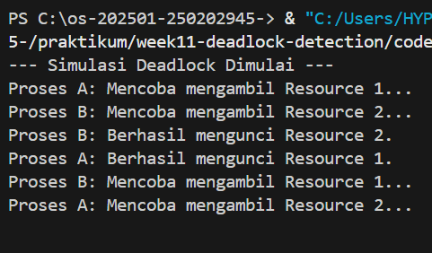

# Laporan Praktikum Minggu [11]
Topik: Manajemen Memori – Page Replacement (FIFO & LRU)

---

## Identitas
- **Nama**  : Latifah Risti Anggraeni  
- **NIM**   : 250202945  
- **Kelas** : 1IKRB

---

## Tujuan
1. Mengimplementasikan algoritma page replacement FIFO dalam program.
2. Mengimplementasikan algoritma page replacement LRU dalam program.
3. Menjalankan simulasi page replacement dengan dataset tertentu.
4. Membandingkan performa FIFO dan LRU berdasarkan jumlah *page fault*.
5. Menyajikan hasil simulasi dalam laporan yang sistematis.

---

## Dasar Teori
Deadlock adalah kondisi di mana sekumpulan proses terhenti karena setiap proses memegang sumber daya (resource) dan menunggu sumber daya lain yang dipegang oleh proses lain dalam kumpulan tersebut.

Menurut Silberschatz, deadlock hanya dapat terjadi jika empat kondisi berikut terpenuhi secara simultan:

1. Mutual Exclusion: Hanya satu proses yang dapat menggunakan sumber daya pada satu waktu.

2. Hold and Wait: Proses yang menahan setidaknya satu sumber daya sedang menunggu sumber daya tambahan yang dipegang proses lain.

3. No Preemption: Sumber daya tidak dapat diambil paksa dari proses yang menahannya.

4. Circular Wait: Terdapat rantai sirkular dari proses yang saling menunggu.

Berbeda dengan Prevention (mencegah salah satu dari 4 kondisi di atas) atau Avoidance (menggunakan algoritma Banker), Deadlock Detection membiarkan sistem masuk ke kondisi deadlock, lalu secara periodik menjalankan algoritma untuk memeriksa apakah ada siklus atau kemacetan, kemudian melakukan pemulihan (recovery).

- **FIFO (First-In-First-Out)**: Algoritma yang paling sederhana. Halaman yang pertama kali masuk ke memori adalah yang pertama kali diganti jika memori penuh.

- **LRU (Least Recently Used)**: Algoritma yang lebih cerdas. Ia mengganti halaman yang tidak digunakan untuk jangka waktu terlama. Logikanya, halaman yang baru saja digunakan kemungkinan besar akan digunakan kembali dalam waktu dekat.

---

## Langkah Praktikum
1. **Menyiapkan Dataset**

   Gunakan *reference string* berikut sebagai contoh:
   ```
   7, 0, 1, 2, 0, 3, 0, 4, 2, 3, 0, 3, 2
   ```
   Jumlah frame memori: **3 frame**.

2. **Implementasi FIFO**

   - Simulasikan penggantian halaman menggunakan algoritma FIFO.
   - Catat setiap *page hit* dan *page fault*.
   - Hitung total *page fault*.

3. **Implementasi LRU**

   - Simulasikan penggantian halaman menggunakan algoritma LRU.
   - Catat setiap *page hit* dan *page fault*.
   - Hitung total *page fault*.

4. **Eksekusi & Validasi**

   - Jalankan program untuk FIFO dan LRU.
   - Pastikan hasil simulasi logis dan konsisten.
   - Simpan screenshot hasil eksekusi.

5. **Analisis Perbandingan**

   Buat tabel perbandingan seperti berikut:

   | Algoritma | Jumlah Page Fault | Keterangan |
   |:--|:--:|:--|
   | FIFO | ... | ... |
   | LRU | ... | ... |


   - Jelaskan mengapa jumlah *page fault* bisa berbeda.
   - Analisis algoritma mana yang lebih efisien dan alasannya.

6. **Commit & Push**

   ```bash
   git add .
   git commit -m "Minggu 10 - Page Replacement FIFO & LRU"
   git push origin main
   ```


---

## Kode / Perintah
```
   7, 0, 1, 2, 0, 3, 0, 4, 2, 3, 0, 3, 2
   ```
   Jumlah frame memori: **3 frame**.

---

## Hasil Eksekusi
## Simulasi

---

## Analisis

Berdasarkan simulasi pada dataset yang diberikan, sistem teridentifikasi berada dalam kondisi Deadlock. Analisis logisnya adalah sebagai berikut:

1. Terdapat siklus saling menunggu antara P1, P2, dan P3. P1 memegang R1 dan meminta R2, P2 memegang R2 dan meminta R3, sementara P3 memegang R3 dan meminta R1.

2. Karena seluruh unit resource (R1, R2, R3) telah teralokasi sepenuhnya ke proses-proses tersebut dan tidak ada yang bisa menyelesaikan tugasnya, maka Available Resource menjadi nol.

3. Program mendeteksi bahwa tidak ada satu pun proses yang dapat diubah statusnya menjadi Finish = True karena permintaan (Request) selalu lebih besar dari sumber daya yang tersedia (Work).


### Tabel Perbandingan
Simulasi dilakukan menggunakan reference string [7, 0, 1, 2, 0, 3, 0, 4, 2, 3] dengan kapasitas 3 frame.

| Algoritma | Page Fault | Analisis Performa |
| :--- | :---: | :--- |
| **FIFO** | **9** | Terjadi banyak *fault* karena algoritma ini "buta" terhadap frekuensi akses; ia hanya membuang halaman yang paling lama berada di memori tanpa mempedulikan apakah halaman tersebut masih sering digunakan. |
| **LRU** | **8** | Lebih efisien karena memanfaatkan prinsip *locality of reference*. Dengan mempertahankan halaman yang baru saja diakses (seperti page `0` yang sering muncul), LRU berhasil mengurangi satu *page fault* dibandingkan FIFO. |

- Kejadian ini membuktikan bahwa tanpa mekanisme prevention atau avoidance, sistem sangat rentan berhenti total (stuck) jika terjadi siklus permintaan sumber daya.

- Hasil simulasi menunjukkan bahwa algoritma yang lebih kompleks seperti LRU memberikan hasil yang lebih baik (optimal) dalam meminimalkan gangguan pada sistem (page fault) dibandingkan algoritma sederhana seperti FIFO.

---

## Kesimpulan
1. Algoritma deteksi deadlock terbukti mampu mengidentifikasi proses yang terjebak dalam kondisi Circular Wait dengan memeriksa ketersediaan sumber daya dibandingkan dengan permintaan (request) saat ini.

2. Berbeda dengan prevention yang kaku, metode deteksi memberikan fleksibilitas pada sistem untuk menggunakan sumber daya secara maksimal, namun memerlukan mekanisme pemulihan (seperti terminasi proses atau rollback) setelah deadlock terdeteksi.

3. Pemilihan algoritma penggantian halaman sangat memengaruhi performa sistem. Algoritma LRU (Least Recently Used) umumnya menghasilkan page fault yang lebih sedikit dibandingkan FIFO (First-In-First-Out) karena LRU memanfaatkan riwayat penggunaan halaman untuk memprediksi kebutuhan masa depan.

4. Terjadinya page fault adalah hal yang wajar dalam sistem memori virtual, namun meminimalkannya sangat penting untuk mencegah terjadinya thrashing (kondisi di mana sistem terlalu sibuk mengganti halaman sehingga performa menurun drastis).

Baik deteksi deadlock maupun strategi manajemen halaman, bertujuan untuk mengoptimalkan penggunaan sumber daya yang terbatas (CPU, I/O, dan Memori) agar sistem operasi tetap berjalan stabil dan responsif.

---

## Quiz
1. Apa perbedaan utama FIFO dan LRU?  
   **Jawaban:**  
   FIFO mengganti halaman berdasarkan urutan waktu masuk sedangkan LRU mengganti halaman berdasarkan riwayat penggunaan.

2. Mengapa FIFO dapat menghasilkan *Belady’s Anomaly*?  
   **Jawaban:**  
   Karena FIFO tidak mempertimbangkan pola akses halaman, sehingga pada skenario tertentu, menambah jumlah frame justru bisa menyebabkan jumlah page fault meningkat.

3. Mengapa LRU umumnya menghasilkan performa lebih baik dibanding FIFO?  
   **Jawaban:**  
   Karena LRU memanfaatkan prinsip locality of reference, yaitu mempertahankan halaman yang baru saja diakses karena kemungkinan besar akan digunakan kembali dalam waktu dekat.

---

## Refleksi Diri
Tantangannya dibagian mengonversi logika teori (seperti Circular Wait pada Deadlock dan Least Recently Used pada LRU) ke dalam kode program yang stabil, terutama saat mengelola urutan data di dalam memori tanpa bantuan library tambahan.

cara mengatasinya dengan melakukan simulasi manual (tracing) di atas kertas terlebih dahulu untuk memastikan alur logika benar, kemudian menggunakan fungsi modular dalam Python untuk memisahkan setiap algoritma agar lebih mudah diperiksa kesalahannya.

---

**Credit:**  
_Template laporan praktikum Sistem Operasi (SO-202501) – Universitas Putra Bangsa_
