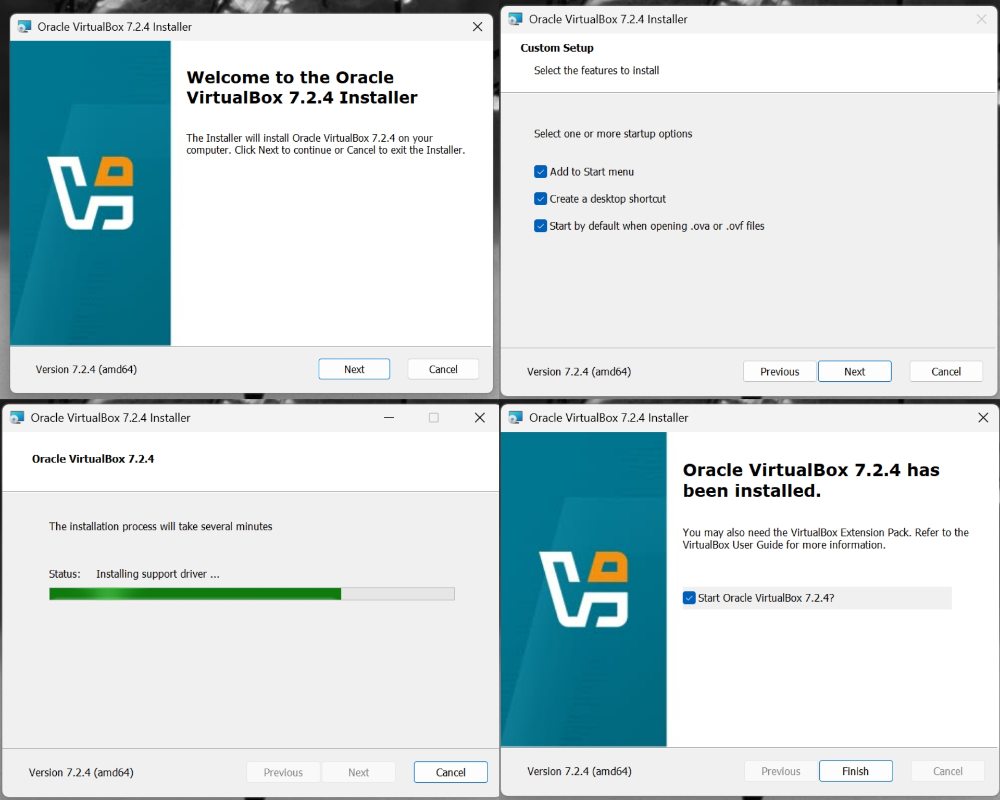
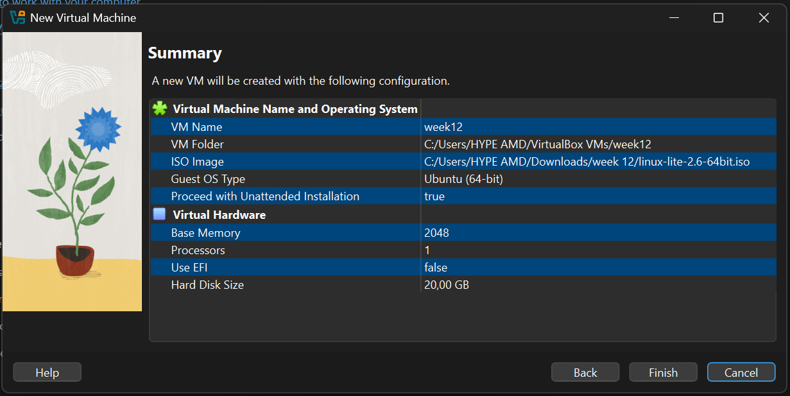
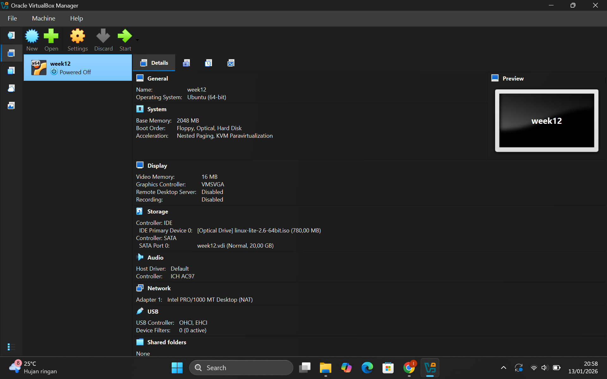
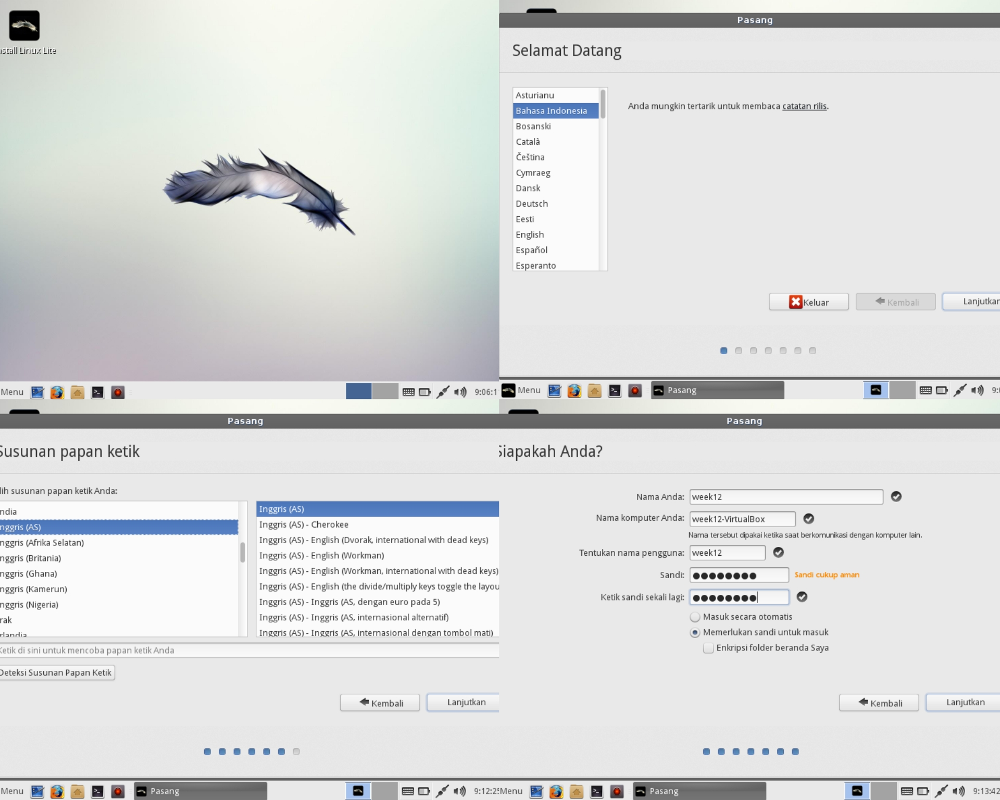
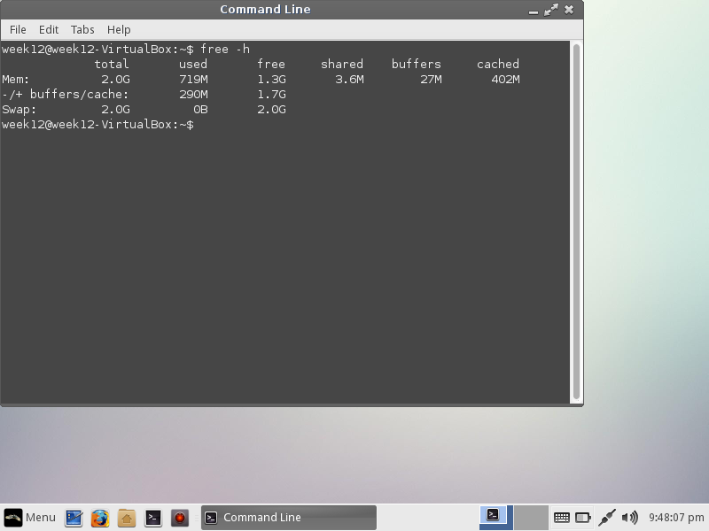
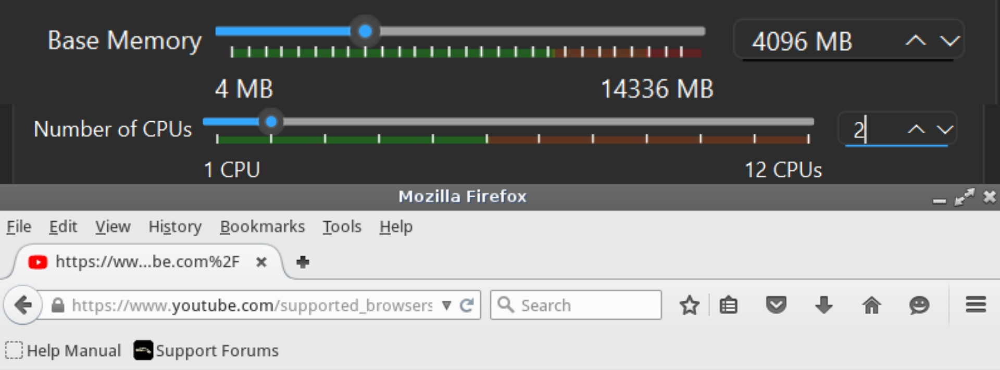

# Laporan Praktikum Minggu [12]
Topik: [Virtualisasi Menggunakan Virtual Machine]

---

## Identitas
- **Nama**  : [Latifah Risti Anggraeni]  
- **NIM**   : [250202945]  
- **Kelas** : [1IKRB]

---

## Tujuan
1. Menginstal perangkat lunak virtualisasi (VirtualBox/VMware).  
2. Membuat dan menjalankan sistem operasi guest di dalam VM.  
3. Mengatur konfigurasi resource VM (CPU, RAM, storage).  
4. Menjelaskan mekanisme proteksi OS melalui virtualisasi.  
5. Menyusun laporan praktikum instalasi dan konfigurasi VM secara sistematis.

---

## Dasar Teori
1. Dasar teori 
Pengertian Virtual Machine
Virtual Machine adalah mesin virtual berbasis perangkat lunak yang dapat menjalankan sistem operasi layaknya komputer fisik dengan memanfaatkan sumber daya dari host. 

2. Konsep Virtualisasi
Virtualisasi memungkinkan satu perangkat keras fisik menjalankan beberapa sistem operasi secara bersamaan melalui proses abstraksi sumber daya seperti CPU, memori, dan storage. 

3. Host OS dan Guest OS
Host OS adalah sistem operasi utama pada komputer fisik, sedangkan Guest OS adalah sistem operasi yang berjalan di dalam VM. 

4. Isolasi dan Keamanan Sistem
Virtual Machine (VM) menyediakan isolasi antar sistem sehingga gangguan, kesalahan, atau serangan pada satu VM tidak memengaruhi sistem lain maupun host, mendukung konsep sandboxing dan keamanan OS.

---

## Langkah Praktikum
1. **Instalasi Virtual Machine**
   - Instal VirtualBox atau VMware pada komputer host.  
   - Pastikan fitur virtualisasi (VT-x / AMD-V) aktif di BIOS.

2. **Pembuatan OS Guest**
   - Buat VM baru dan pilih OS guest (misal: Ubuntu Linux).  
   - Atur resource awal:
     - CPU: 1–2 core  
     - RAM: 2–4 GB  
     - Storage: ≥ 20 GB

3. **Instalasi Sistem Operasi**
   - Jalankan proses instalasi OS guest sampai selesai.  
   - Pastikan OS guest dapat login dan berjalan normal.

4. **Konfigurasi Resource**
   - Ubah konfigurasi CPU dan RAM.  
   - Amati perbedaan performa sebelum dan sesudah perubahan resource.

5. **Analisis Proteksi OS**
   - Jelaskan bagaimana VM menyediakan isolasi antara host dan guest.  
   - Kaitkan dengan konsep *sandboxing* dan *hardening* OS.

6. **Dokumentasi**
   - Ambil screenshot setiap tahap penting.  
   - Simpan di folder `screenshots/`.

7. **Commit & Push**
   ```bash
   git add .
   git commit -m "Minggu 12 - Virtual Machine"
   git push origin main
   ```

---

## Kode / Perintah
Tuliskan potongan kode atau perintah utama:
```# Mengecek alokasi memori (RAM)
free -h

# Mengecek arsitektur dan jumlah Core CPU
lscpu

# Melihat proses sistem dan penggunaan resource secara real-time
top
```

---

## Hasil Eksekusi
# Tahap Awal





# Percobaan 1

Membuat Akun Linux


Mengatur RAM dan CPU (2&1)
.jpg)
Mencoba membuka Youtube

.png)
.png)
Verifikasi resource dan monitoring sistem
# Percobaan 2

Menentukan RAM & CPU (mencoba membuka Youtube)
.png)
.png)
.png)
Verifikasi resource dan monitoring sistem
---

## Analisis
5. Catatan Konfigurasi

A. SPESIFIKASI HOST (KOMPUTER ASLI)
--------------------------------------------------
OS Host        : Windows 10 64-bit
RAM Host       : 16 GB
Processor Host : AMD (12 CPU Logical)
Software VM    : Oracle VirtualBox 7.2.4
File ISO       : linux-lite-2.6-64bit.iso
Lokasi VM      : C:\Users\HYPE AMD\VirtualBox VMs

B. IDENTITAS GUEST OS
--------------------------------------------------
Nama VM        : week12
OS Guest       : Linux Ubuntu (64-bit)
Arsitektur     : x86_64
Hypervisor     : KVM (VirtualBox)
Mode CPU       : 32-bit, 64-bit

C. KONFIGURASI RESOURCE VM
--------------------------------------------------
Base Memory (RAM) : 4096 MB (4 GB)
Processor (CPU)   : 2 Core
Base Disk Memory  : 20 GB
Video Memory      : 128 MB

D. HASIL PENGUJIAN (BERDASARKAN TERMINAL)
--------------------------------------------------
Perintah free -h:
- Total RAM     : ± 3.9 GB
- RAM Digunakan : ± 700–800 MB
- Swap          : 2.0 GB (0 digunakan)

Perintah lscpu:
- CPU(s)        : 2
- Architecture  : x86_64
- Virtualization: Full

Perintah top:
- Sistem stabil
- Beban CPU rendah
- Firefox dapat berjalan dan membuka beberapa tab tanpa lag

Virtual Machine menjalankan sistem operasi guest (Ubuntu Linux) di atas host (Windows 10) melalui hypervisor VirtualBox. Guest OS tidak memiliki akses langsung ke perangkat keras fisik, melainkan menggunakan resource virtual (CPU, RAM, dan disk) yang dialokasikan oleh hypervisor. Hal ini terbukti dari hasil pengujian free -h, lscpu, dan top, di mana perubahan resource hanya memengaruhi kinerja VM tanpa berdampak pada sistem host. Dengan demikian, jika terjadi error, lag, atau gangguan pada guest OS, sistem host tetap berjalan normal karena keduanya terisolasi.

Isolasi yang diterapkan oleh VM merupakan bentuk sandboxing, yaitu menjalankan sistem dalam lingkungan terbatas dan terpisah. Pada praktikum, Ubuntu Linux berjalan di dalam sandbox VM sehingga aktivitas seperti instalasi aplikasi dan pengujian performa tidak memengaruhi host. Selain itu, VM mendukung hardening OS karena sistem guest dapat diuji, dikonfigurasi, atau diamankan (misalnya pengaturan resource dan user) tanpa risiko terhadap sistem utama. Hal ini membuat virtualisasi aman digunakan untuk pembelajaran dan eksperimen sistem operasi.

---

## Kesimpulan
**Virtual Machine memungkinkan isolasi sistem operasi**
Sistem operasi guest dapat berjalan secara terpisah dari host melalui hypervisor, sehingga gangguan atau kesalahan pada guest OS tidak memengaruhi sistem host.

**Konfigurasi resource memengaruhi kinerja VM**
Hasil praktikum menunjukkan bahwa penambahan CPU dan RAM meningkatkan performa OS guest, sedangkan resource yang rendah menyebabkan sistem berjalan lebih lambat.

**Virtualisasi meningkatkan keamanan dan fleksibilitas**
VM mendukung konsep sandboxing dan hardening OS, sehingga aman digunakan untuk pembelajaran, pengujian sistem, dan eksperimen tanpa risiko terhadap sistem utama.

---

## Quiz
1. 1. Apa perbedaan antara host OS dan guest OS?
**Jawab:** Host os adalah sistem operasi utama yang berjalan di perangkat keras fisik komputer (RAM, disk, jaringan). Sedangkan Guest os adalah sistem operasi tamu yang berjalan di mesin virtual (VM).

2. Apa peran hypervisor dalam virtualisasi?
**Jawab:** Peran hypervisor dalam virtualisasi adalah sebagai pengelola Virtual Machine (VM) yang mengatur pembagian dan penggunaan sumber daya hardware agar setiap VM dapat berjalan secara efisien.

3. Mengapa virtualisasi meningkatkan keamanan sistem?
**Jawab:** Karena pada virtualisasi menyediakan isolasi anatara sistem. Isolasi ini membuat aktivitas di dalam satu Virtual Machine (VM) tidak secara langsung memengaruhi sistem lain maupun sistem utama (host). Dengan begitu, risiko kerusakan sistem menjadi lebih kecil dan lebih aman.

---

## Refleksi Diri
Tuliskan secara singkat:
- Apa bagian yang paling menantang minggu ini?  
- Bagaimana cara Anda mengatasinya?  

---

**Credit:**  
_Template laporan praktikum Sistem Operasi (SO-202501) – Universitas Putra Bangsa_
