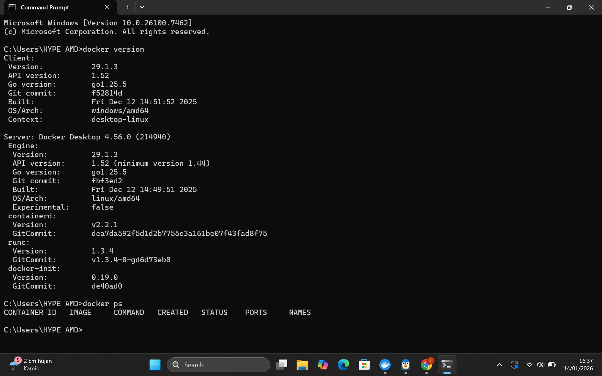
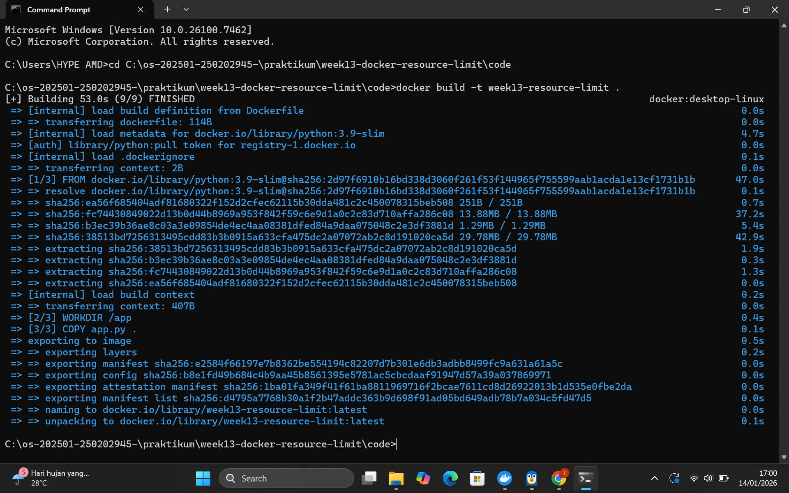
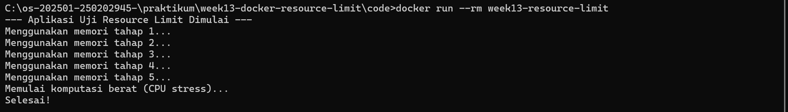
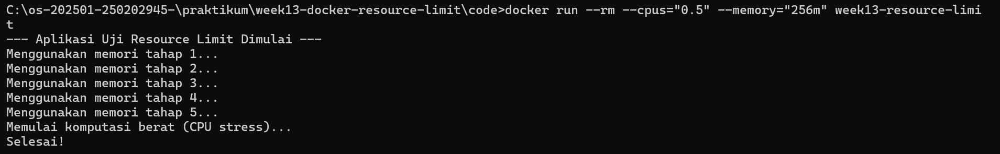
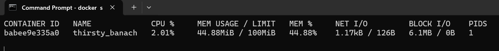

# Laporan Praktikum Minggu 13
Topik: Docker – Resource Limit (CPU & Memori)

---

## Identitas
- **Nama**  : Latifah Risti Anggraeni  
- **NIM**   : 250202945  
- **Kelas** : 1IKRB

---

## Tujuan
1. Menulis Dockerfile sederhana untuk sebuah aplikasi/skrip.
2. Membangun image dan menjalankan container.
3. Menjalankan container dengan pembatasan **CPU** dan **memori**.
4. Mengamati dan menjelaskan perbedaan eksekusi container dengan dan tanpa limit resource.
5. Menyusun laporan praktikum secara runtut dan sistematis.

---

## Dasar Teori
1. Containerization & Isolation
Docker menggunakan namespace untuk isolasi proses dan cgroups (Control Groups) untuk membatasi penggunaan sumber daya fisik.

2. Memory Limit
Menentukan jumlah maksimum RAM yang dapat digunakan container. Jika dilampaui, kernel dapat memicu OOM (Out Of Memory) Killer.

3. CPU Limit
Mengatur kuota waktu pemrosesan yang diberikan kepada container (misal --cpus="0.5" berarti container hanya mendapat 50% dari total waktu CPU per detik).

4. Docker Stats
Alat monitoring bawaan Docker untuk melihat penggunaan resource secara real-time.

---

## Langkah Praktikum
1. **Persiapan Lingkungan**

   - Pastikan Docker terpasang dan berjalan.
   - Verifikasi:
     ```bash
     docker version
     docker ps
     ```

2. **Membuat Aplikasi/Skrip Uji**

   Buat program sederhana di folder `code/` (bahasa bebas) yang:
   - Melakukan komputasi berulang (untuk mengamati limit CPU), dan/atau
   - Mengalokasikan memori bertahap (untuk mengamati limit memori).

3. **Membuat Dockerfile**

   - Tulis `Dockerfile` untuk menjalankan program uji.
   - Build image:
     ```bash
     docker build -t week13-resource-limit .
     ```

4. **Menjalankan Container Tanpa Limit**

   - Jalankan container normal:
     ```bash
     docker run --rm week13-resource-limit
     ```
   - Catat output/hasil pengamatan.

5. **Menjalankan Container Dengan Limit Resource**

   Jalankan container dengan batasan resource (contoh):
   ```bash
   docker run --rm --cpus="0.5" --memory="256m" week13-resource-limit
   ```
   Catat perubahan perilaku program (mis. lebih lambat, error saat memori tidak cukup, dll.).

6. **Monitoring Sederhana**

   - Jalankan container (tanpa `--rm` jika perlu) dan amati penggunaan resource:
     ```bash
     docker stats
     ```
   - Ambil screenshot output eksekusi dan/atau `docker stats`.

7. **Commit & Push**

   ```bash
   git add .
   git commit -m "Minggu 13 - Docker Resource Limit"
   git push origin main
   ```
---

## Kode / Perintah
```bash
   docker version
   docker ps
   ```

```bash
   docker build -t week13-resource-limit .
   ```
     
```bash
   docker run --rm week13-resource-limit
   ```
```
docker run --rm --cpus="0.5" --memory="256m" week13-resource-limit
```

---

## Hasil Eksekusi



Terdapat perbedaan durasi build antara eksekusi pertama (53 detik) dan kedua (3.5 detik). Hal ini dikarenakan fitur Layer Caching pada Docker. Pada build kedua, Docker menggunakan cache untuk layer yang tidak mengalami perubahan, sehingga mempercepat proses pengembangan aplikasi.

Tanpa Limit

Menggunakan Limit


---

## Analisis
1. Dampak Limit Memori
Saat container dibatasi 256m, Python mencoba mengalokasikan memori melebihi ambang batas tersebut. Sistem Operasi host mendeteksi pelanggaran cgroups dan mengirim sinyal SIGKILL untuk menghentikan container demi menjaga stabilitas host.

2. Dampak Limit CPU
Limit CPU tidak menyebabkan aplikasi mati, melainkan memperlambat kecepatan eksekusi (throtling). Ini terlihat dari durasi per iterasi yang lebih lama dibandingkan saat berjalan tanpa limit.

3. Mekanisme Isolasi
Docker di Linux menggunakan cgroups secara langsung, sedangkan pada Windows/macOS, limitasi ini dikelola melalui layer virtualisasi (Hyper-V atau WSL2 backend) yang membagi resource dari VM Docker Desktop ke container.

---

## Kesimpulan
Pembatasan resource sangat penting dalam lingkungan multi-container untuk mencegah satu aplikasi mendominasi seluruh hardware host.

Penggunaan memori yang melebihi limit akan menyebabkan kegagalan fatal (Killed), sedangkan limit CPU hanya akan menyebabkan penurunan performa (Throttling).

---

## Quiz
1. Mengapa container perlu dibatasi CPU dan memori? 
**Jawaban:** Untuk mencegah "Noisy Neighbor Effect", memastikan stabilitas sistem host, dan menjamin ketersediaan resource bagi container lain di lingkungan yang sama.

2. Apa perbedaan VM dan container dalam konteks isolasi resource? 
**Jawaban:** VM mengalokasikan resource secara tetap (hard-allocated) di level hardware via Hypervisor sejak awal dinyalakan. Container berbagi kernel host dan menggunakan cgroups untuk membatasi resource secara fleksibel (soft/hard limit) tanpa perlu mengunci seluruh kapasitas resource tersebut dari host.

3. Apa dampak limit memori terhadap aplikasi yang boros memori? 
**Jawaban:** Aplikasi akan dihentikan secara paksa oleh kernel (Out of Memory Killer) jika mencoba menggunakan RAM melampaui limit yang ditentukan, menyebabkan container keluar dengan status error (biasanya Exit Code 137).

---

## Refleksi Diri
Bagian tantangan saat memahami perbedaan perilaku limitasi saat menggunakan Docker Desktop di Windows karena adanya layer WSL2.

Cara mengatasi nya yaitu dengan membaca dokumentasi Docker mengenai "Resource Constraints" dan melakukan eksperimen berulang dengan nilai limit yang berbeda-beda.  

---

**Credit:**  
_Template laporan praktikum Sistem Operasi (SO-202501) – Universitas Putra Bangsa_
