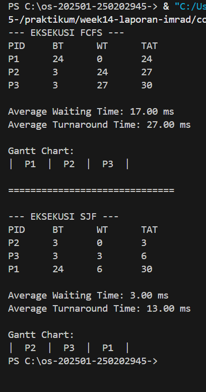

# Laporan Praktikum Minggu 14
Topik: Penyusunan Laporan Praktikum Format IMRAD

---

## Identitas
- **Nama**  : Latifah Risti Anggraeni  
- **NIM**   : 250202945  
- **Kelas** : 1IKRB

## B. Tujuan
1. Menyusun laporan praktikum dengan struktur ilmiah (Pendahuluan–Metode–Hasil–Pembahasan–Kesimpulan).
2. Menyajikan hasil uji dalam bentuk tabel dan/atau grafik yang jelas.
3. Menuliskan analisis hasil dengan argumentasi yang logis.
4. Menyusun sitasi dan daftar pustaka dengan format yang konsisten.
5. Mengunggah draft laporan ke repositori dengan rapi dan tepat waktu.

---

## Dasar Teori
Laporan IMRAD digunakan untuk merangkum praktikum-praktikum sebelumnya (mis. scheduling, page replacement, deadlock detection, VM/Docker) agar hasil uji dapat dipahami, direplikasi, dan dievaluasi secara akademik.

---

## D. Langkah Pengerjaan
1. **Menentukan Topik Laporan**

   Pilih 1 topik dari praktikum sebelumnya (mis. Minggu 9/10/11/13) dan tetapkan tujuan eksperimen yang ingin disampaikan.

2. **Menyiapkan Bahan**

   - Kode/program yang digunakan.
   - Dataset/parameter uji (jika ada).
   - Bukti hasil eksekusi (screenshot) dan/atau grafik.

3. **Menulis Laporan dengan Struktur IMRAD**

   Tulis `praktikum/week14-laporan-imrad/laporan.md` dengan struktur minimal berikut:
   - **Pendahuluan (Introduction):** latar belakang, rumusan masalah/tujuan.
   - **Metode (Methods):** lingkungan uji, langkah eksperimen, parameter/dataset, cara pengukuran.
   - **Hasil (Results):** tabel/grafik hasil uji, ringkasan temuan.
   - **Pembahasan (Discussion):** interpretasi hasil, keterbatasan, perbandingan teori/ekspektasi.
   - **Kesimpulan:** 2–4 poin ringkas menjawab tujuan.

4. **Menyajikan Tabel/Grafik**

   - Tabel harus diberi judul/keterangan singkat.
   - Jika menggunakan grafik: jelaskan sumbu dan arti grafik.

5. **Sitasi dan Daftar Pustaka**

   - Cantumkan referensi minimal 2 sumber.
   - Gunakan format konsisten (mis. daftar bernomor).

6. **Commit & Push Draft**

   ```bash
   git add .
   git commit -m "Minggu 14 - Draft Laporan IMRAD"
   git push origin main
   ```
---
## Menulis Laporan dengan Struktur IMRAD

### 1. Introduction (Pendahuluan)
### Latar Belakang
Efisiensi penggunaan CPU sangat bergantung pada algoritma penjadwalan yang digunakan oleh sistem operasi. Dalam lingkungan multiprogramming, seringkali terjadi antrean proses yang memiliki karakteristik *burst time* (waktu eksekusi) yang kontras. Penjadwalan CPU didefinisikan sebagai tugas memilih proses dari memori yang siap dieksekusi untuk dialokasikan ke CPU (Silberschatz et al., 2018).

Masalah muncul ketika proses panjang tiba lebih dulu dalam algoritma **First-Come First-Served (FCFS)**, yang menyebabkan proses pendek tertahan lama (Convoy Effect). Sebagai alternatif, algoritma **Shortest Job First (SJF)** digunakan untuk memprioritaskan proses dengan beban kerja terkecil.

### Rumusan Masalah
1. Bagaimana perbandingan *Average Waiting Time* (AWT) antara algoritma FCFS dan SJF pada kumpulan proses yang sama?
2. Seberapa besar pengaruh *Convoy Effect* terhadap efisiensi waktu pada algoritma FCFS?

### Tujuan
1. Mengukur kinerja FCFS dan SJF menggunakan metrik *Waiting Time* dan *Turnaround Time*.
2. Memvalidasi teori bahwa SJF memberikan rata-rata waktu tunggu minimum untuk sekumpulan proses yang tersedia secara simultan.

## 2. Methods (Metode)
* **Lingkungan Uji:** Terminal Windows PowerShell dengan Python Simulator.
* **Parameter Uji:** * P1: Burst Time (BT) = 24
    * P2: Burst Time (BT) = 3
    * P3: Burst Time (BT) = 3
* **Langkah Eksperimen:**
    1. Menjalankan skrip `scheduling_sim.py` untuk menguji urutan FCFS (P1, P2, P3).
    2. Menjalankan skrip yang sama untuk mengurutkan secara SJF (P2, P3, P1).
    3. Mengambil screenshot hasil eksekusi terminal sebagai bukti data.

---

## 3. Results (Hasil)

Berdasarkan eksekusi program, didapatkan data metrik sebagai berikut:

**Tabel 1. Hasil Eksekusi Simulator Penjadwalan**
| Algoritma | Avg. Waiting Time (AWT) | Avg. Turnaround Time (ATAT) | Penjelasan Perbandingan Kinerja |
| :--- | :---: | :---: | :--- |
| FCFS | 17.00 ms | 27.00 ms | Memiliki performa kurang efisien karena proses pendek harus menunggu proses panjang (Convoy Effect), sehingga waktu tunggu membengkak. |
| SJF | 3.00 ms | 13.00 ms | Sangat optimal karena memprioritaskan durasi terpendek, berhasil menekan rata-rata waktu tunggu hingga 82% lebih rendah dibanding FCFS. |

s

## 4. Discussion (Pembahasan)
Hasil pengujian menunjukkan perbedaan *Average Waiting Time* yang signifikan. Pada FCFS, terjadi **Convoy Effect** di mana proses pendek (P2 dan P3) terhambat oleh proses panjang (P1), sehingga menghasilkan AWT sebesar **17.00 ms**. Sebaliknya, algoritma SJF berhasil menekan AWT hingga **3.00 ms** dengan mendahulukan proses yang lebih cepat selesai. 

Sebagaimana dijelaskan oleh **Arpaci-Dusseau & Arpaci-Dusseau (2018)**, SJF secara matematis terbukti memberikan rata-rata waktu tunggu minimum untuk sekumpulan proses yang tetap. Namun, **Silberschatz et al. (2018)** mengingatkan bahwa tantangan utama SJF di dunia nyata adalah sulitnya memprediksi panjang *burst time* proses berikutnya secara akurat sebelum eksekusi dilakukan.

---

## 5. Kesimpulan
1. SJF memberikan efisiensi waktu tunggu rata-rata yang jauh lebih baik (3.00 ms) dibandingkan FCFS (17.00 ms) untuk dataset yang diuji.
2. Penjadwalan FCFS rentan terhadap pembengkakan waktu tunggu jika proses dengan *burst time* besar dieksekusi di awal.
3. SJF merupakan algoritma yang optimal dalam meminimalkan *waiting time* rata-rata pada antrean proses statis.

---

### Daftar Pustaka
1. Silberschatz, A., Galvin, P. B., & Gagne, G. (2018). *Operating System Concepts* (10th ed.). [os-book.com](https://www.os-book.com/OS10/index.html)
2. Arpaci-Dusseau, R. H., & Arpaci-Dusseau, A. C. (2018). *Operating Systems: Three Easy Pieces*. [ostep.org](https://ostep.org/)

---

### Jawaban Quiz
1. Mengapa IMRAD membantu? Format ini menyediakan alur logika yang konsisten sehingga penguji dapat memvalidasi data (Results) secara terpisah dari opini penulis (Discussion).

2. Perbedaan Hasil vs Pembahasan?
Bagian *Hasil* berisi data faktual (angka/tabel/grafik), sedangkan *Pembahasan* menjelaskan fenomena di balik angka tersebut (seperti menjelaskan mengapa Convoy Effect terjadi).

3. Pentingnya Sitasi? Menunjukkan bahwa laporan didasarkan pada teori OS yang valid dan menghargai karya ilmiah orang lain.

---

## Refleksi Diri
Bagian yang paling menantang minggu ini adalah melakukan transisi dari penulisan laporan praktikum biasa ke format ilmiah IMRAD yang sistematis. Memisahkan antara data objektif di bagian Results dengan analisis subjektif di bagian Discussion memerlukan ketelitian agar tidak terjadi tumpang tindih informasi. Selain itu, memastikan data hasil simulasi (seperti Convoy Effect pada FCFS) benar-benar akurat sesuai dengan teori yang ada juga menjadi tantangan tersendiri.

Cara mengatasinya dengan melakukan simulasi berulang kali menggunakan skrip Python untuk mendapatkan data yang konsisten. Saya juga merujuk kembali pada literatur utama (seperti Operating System Concepts oleh Silberschatz) untuk memahami landasan teori setiap algoritma sebelum mulai menulis bagian pembahasan. Penggunaan tabel perbandingan sangat membantu saya dalam mengorganisir data sehingga proses analisis menjadi lebih logis dan terstruktur.

---

**Credit:**  
_Template laporan praktikum Sistem Operasi (SO-202501) – Universitas Putra Bangsa_
