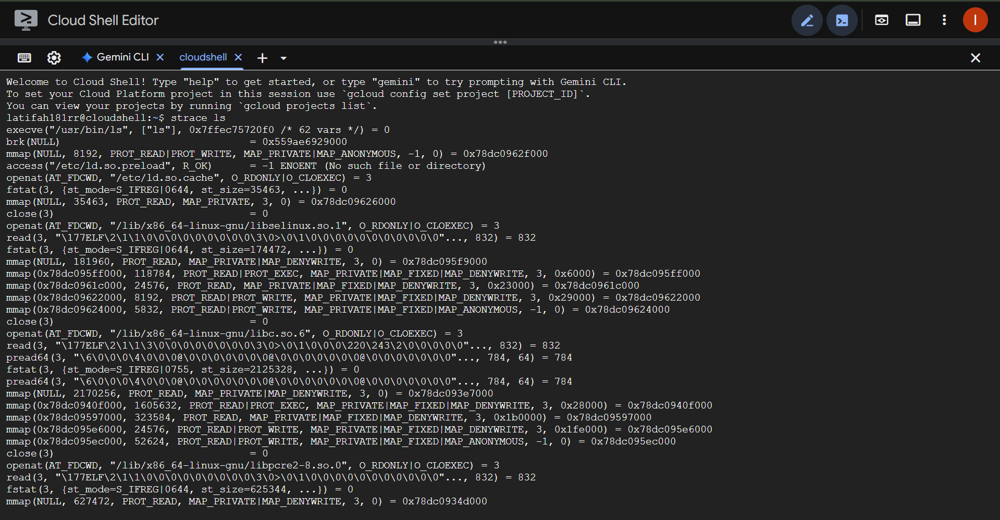
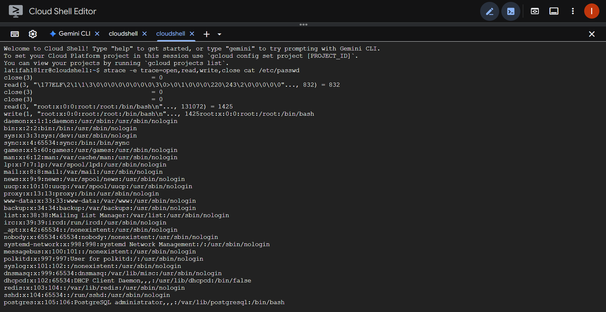
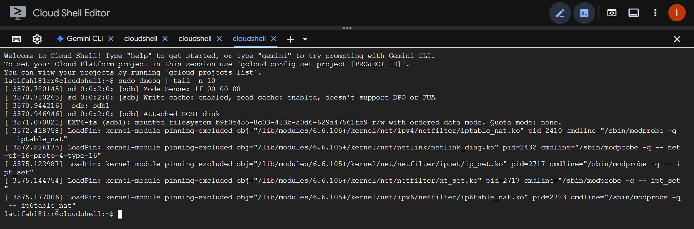
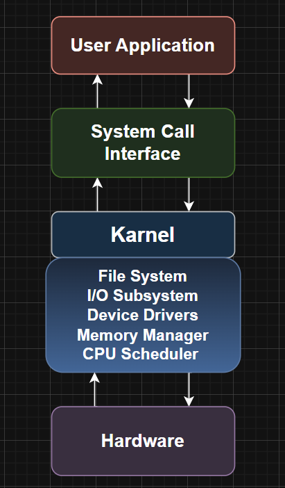

# Laporan Praktikum Minggu [2]
Topik: [Syscall Structure]

---

## Identitas
- **Nama**  : [Latifah Risti Anggraeni]  
- **NIM**   : [250202945]  
- **Kelas** : [1IKRB]

---

## Tujuan
1. Menjelaskan konsep dan fungsi system call dalam sistem operasi.
2. Mengidentifikasi jenis-jenis system call dan fungsinya.
3. Mengamati alur perpindahan mode user ke kernel saat system call terjadi.
4. Menggunakan perintah Linux untuk menampilkan dan menganalisis system call.

---

## Dasar Teori
1. **System Call**  
   System call adalah mekanisme yang digunakan oleh program di *user mode* untuk meminta layanan dari sistem operasi yang berjalan di *kernel mode*. Melalui system call, aplikasi dapat mengakses sumber daya seperti file, memori, dan perangkat keras secara aman.

2. **Kernel**  
   Kernel merupakan inti dari sistem operasi yang bertugas mengelola sumber daya perangkat keras dan memberikan layanan sistem ke aplikasi. Kernel bekerja di mode istimewa (*privileged mode*) agar dapat mengakses semua bagian sistem.

3. **User Mode dan Kernel Mode**  
   Sistem operasi modern membedakan dua mode eksekusi:  
   - **User mode** → program pengguna berjalan dengan akses terbatas.  
   - **Kernel mode** → sistem operasi memiliki akses penuh ke perangkat keras.  
   Pergantian dari *user mode* ke *kernel mode* terjadi ketika program melakukan system call.

4. **Lapisan Komunikasi (System Call Interface)**  
   *System Call Interface (SCI)* berfungsi sebagai penghubung antara aplikasi pengguna dengan kernel. Ketika aplikasi melakukan system call, SCI meneruskan permintaan ke kernel untuk diproses dan hasilnya dikembalikan ke aplikasi.

5. **Fungsi System Call dalam Sistem Operasi**  
   System call menyediakan antarmuka standar untuk layanan penting seperti:  
   - Manajemen file (`open`, `read`, `write`, `close`)  
   - Manajemen proses (`fork`, `exec`, `wait`, `exit`)  
   - Manajemen memori (`mmap`, `brk`)  
   - Komunikasi antar proses (`pipe`, `socket`)

---

## Langkah Praktikum
1. **Setup Environment**
   - Gunakan Linux (Ubuntu/WSL).
   - Pastikan perintah `strace` dan `man` sudah terinstal.
   - Konfigurasikan Git (jika belum dilakukan di minggu sebelumnya).

2. **Eksperimen 1 – Analisis System Call**
   Jalankan perintah berikut:
   ```bash
   strace ls
   ```
   > Catat 5–10 system call pertama yang muncul dan jelaskan fungsinya.  
   Simpan hasil analisis ke `results/syscall_ls.txt`.

3. **Eksperimen 2 – Menelusuri System Call File I/O**
   Jalankan:
   ```bash
   strace -e trace=open,read,write,close cat /etc/passwd
   ```
   > Analisis bagaimana file dibuka, dibaca, dan ditutup oleh kernel.

4. **Eksperimen 3 – Mode User vs Kernel**
   Jalankan:
   ```bash
   dmesg | tail -n 10
   ```
   > Amati log kernel yang muncul. Apa bedanya output ini dengan output dari program biasa?

5. **Diagram Alur System Call**
   - Buat diagram yang menggambarkan alur eksekusi system call dari program user hingga kernel dan kembali lagi ke user mode.
   - Gunakan draw.io / mermaid.
   - Simpan di:
     ```
     praktikum/week2-syscall-structure/screenshots/syscall-diagram.png
     ```

6. **Commit & Push**
   ```bash
   git add .
   git commit -m "Minggu 2 - Struktur System Call dan Kernel Interaction"
   git push origin main
   ```

---

## Kode / Perintah
Potongan kode atau perintah utama:
```bash
   strace ls
   ```
   ---
```bash
   strace -e trace=open,read,write,close cat /etc/passwd
   ```
   ---
   ```bash
   dmesg | tail -n 10
   ```

---

## Hasil Eksekusi
Hasil percobaan atau diagram:

Eksperimen 1

---
Eksperimen 2

---
Eksperimen 3

---

## Analisis
Hasil analisis:
## **Catat 5–10 system call pertama yang muncul dan jelaskan fungsinya.**

| System Call | Fungsi | Penjelasan |
|--------------|--------|--------------------|
| **`execve`** | Menjalankan program | Digunakan untuk mengeksekusi program baru juga menggantikan proses yang sedang berjalan. |
| **`brk`** | Mengatur heap memory | Mengecek atau menyesuaikan batas atas area heap pada proses untuk kebutuhan alokasi memori dinamis. |
| **`mmap`** | Mengalokasikan memori anonim | Membuat pemetaan memori baru di ruang alamat proses, biasanya digunakan untuk membaca file besar atau library. |
| **`access`** | Mengecek hak akses file | Memeriksa apakah proses memiliki izin untuk membaca, menulis, atau mengeksekusi file tertentu. |
| **`openat`** | Membuka file | Membuka file di sistem file dengan path tertentu dan mengembalikan file descriptor untuk operasi berikutnya. |
| **`fstat`** | Mendapatkan informasi file | Mengambil metadata file seperti ukuran, mode (izin akses), dan waktu modifikasi terakhir. |
| **`mmap` (ulang)** | Memetakan file ke memori | Menghubungkan file dengan area memori untuk mempercepat akses tanpa harus membaca file secara manual. |
| **`close`** | Menutup file descriptor | Menutup file yang telah dibuka dan membebaskan sumber daya agar bisa digunakan proses lain. |
---

**File hasil syscall ls dapat dilihat di sini:**
[results/syscall_ls.txt](./results/syscall_ls.txt)
---

## **Analisis bagaimana file dibuka, dibaca, dan ditutup oleh kernel.**
Pada eksperimen ini, perintah `strace -e trace=open,read,write,close cat /etc/passwd` digunakan untuk melihat bagaimana kernel menangani proses pembukaan, pembacaan, dan penutupan file.  

Awalnya terdapat beberapa pemanggilan `close(3)` dan `read(3, "\177ELF...")` yang menandakan proses sedang membaca library atau objek lain melalui file descriptor 3 yang sudah ada sebelumnya.  

Selanjutnya, muncul `read(3, ".../etc/passwd...", 131072) = 1425`, di mana kernel mengembalikan isi file `/etc/passwd` sebesar 1425 byte ke proses `cat`.  
Setelah data berhasil dibaca, system call `write(1, ..., 1425) = 1425` menunjukkan bahwa program `cat` menulis hasil pembacaan tersebut ke *stdout* (layar terminal).  

Ketika proses pembacaan selesai, `read(3, "", 131072) = 0` menandakan *End of File (EOF)*.  
Setelah itu, kernel melakukan *cleanup* melalui pemanggilan `close(3)`, `close(1)`, dan `close(2)` untuk menutup file descriptor yang digunakan selama proses.  

Akhirnya, proses `cat` keluar dengan status `0`, yang berarti eksekusi berhasil tanpa error.  
Secara keseluruhan, alur ini menggambarkan bahwa kernel berperan penting dalam membuka file, menyediakan data ke proses pengguna, dan menutup file setelah selesai digunakan.

---

## **Apa bedanya output ini dengan output dari program biasa?**
1. `dmesg` menampilkan **log aktivitas kernel**, sedangkan program seperti `ls` atau `cat` menampilkan **data hasil proses user**.  
2. `dmesg` berisi **informasi low-level** seperti driver, filesystem, modul kernel, dan perangkat keras.  
3. Output `dmesg` memiliki **timestamp kernel** dan format log sistem, bukan teks biasa.  
4. Akses ke `dmesg` kadang **memerlukan hak root**, sementara `ls` dan `cat` bisa dijalankan oleh user biasa.  
5. `dmesg` bersifat **asinkron dan real-time** (mencatat event kernel saat terjadi), sedangkan program biasa menghasilkan output **sinkron saat dijalankan**.  
6. Tujuan utama `dmesg` adalah **monitoring dan debugging sistem**, sedangkan program biasa digunakan untuk **interaksi langsung dengan data atau file**.

---

## Kesimpulan
Kesimpulan dari praktikum:
- Ketiga eksperimen menunjukkan bahwa **interaksi antara program dan sistem dilakukan melalui system call** yang menjadi jembatan antara *user space* dan *kernel space*.  
- **`strace`** membantu memahami proses internal eksekusi program melalui pemanggilan system call, sedangkan **`dmesg`** menampilkan log aktivitas kernel yang terjadi di level sistem.  
- Kernel berperan penting dalam **mengatur akses ke perangkat keras, file, dan memori**, sehingga setiap operasi program berjalan aman dan terkontrol.

---
## Tugas
## **Dokumentasi hasil eksperimen `strace` dan `dmesg` dalam bentuk tabel observasi.**

| No | Eksperimen               | Syscall / Event                                                                 | FD / Target           | Hasil / Output                              | Fungsi / Keterangan                                                                 |
|----|--------------------------|---------------------------------------------------------------------------------|-----------------------|---------------------------------------------|--------------------------------------------------------------------------------------|
| 1  | strace ls                | execve("/usr/bin/ls", ["ls"], env)                                              | -                     | 0                                           | Menjalankan program `ls`.                                                           |
| 2  | strace ls                | brk(NULL)                                                                       | -                     | 0x5ace8d9a4000                             | Mengecek atau mengatur alamat heap saat ini.                                        |
| 3  | strace ls                | mmap(NULL, 8192, PROT_READ|PROT_WRITE, MAP_PRIVATE|MAP_ANONYMOUS, -1, 0)        | -                     | -                                           | Mengalokasikan memori anonim di ruang proses.                                       |
| 4  | strace ls                | access("/etc/ld.so.preload", R_OK)                                              | -                     | -1 ENOENT                                  | Mengecek file preload library, tidak ditemukan.                                     |
| 5  | strace ls                | openat(AT_FDCWD, "/etc/ld.so.cache", O_RDONLY|O_CLOEXEC)                        | 3                     | 3                                           | Membuka file `ld.so.cache` untuk membaca cache library.                             |
| 6  | strace ls                | fstat(3, ...)                                                                   | 3                     | Info file: size=35463                      | Mendapatkan informasi metadata file.                                                |
| 7  | strace ls                | mmap(NULL, 35463, PROT_READ, MAP_PRIVATE, 3, 0)                                 | 3                     | 0x78933beef000                             | Memetakan isi file ke memori untuk efisiensi akses.                                 |
| 8  | strace ls                | close(3)                                                                        | 3                     | 0                                           | Menutup file descriptor setelah digunakan.                                          |
| 9  | strace cat /etc/passwd   | read(3, ".../etc/passwd...", 131072)                                            | 3                     | 1425 byte                                  | Kernel mengembalikan isi file `/etc/passwd` ke proses `cat`.                        |
| 10 | strace cat /etc/passwd   | write(1, buffer, 1425)                                                          | 1                     | 1425 byte                                  | Menulis data hasil pembacaan ke *stdout* (layar terminal).                          |
| 11 | strace cat /etc/passwd   | read(3, "", 131072)                                                             | 3                     | 0                                           | Menandakan *End of File* (tidak ada data lagi).                                     |
| 12 | strace cat /etc/passwd   | close(3)                                                                        | 3                     | 0                                           | Menutup file descriptor `/etc/passwd`.                                              |
| 13 | dmesg tail -n 10         | [3369.730151] veth876e7e80: entered allmulticast mode                           | veth876e7e80          | -                                           | Antarmuka jaringan `veth` masuk ke mode *allmulticast*.                             |
| 14 | dmesg tail -n 10         | [3369.736688] veth876e7e80: entered promiscuous mode                            | veth876e7e80          | -                                           | Antarmuka jaringan `veth` masuk ke mode *promiscuous*.                              |
| 15 | dmesg tail -n 10         | [3369.987285] EXT4-fs (sdb1): mounted filesystem ...                            | sdb1                  | r/w                                         | Kernel memasang filesystem `EXT4` dalam mode baca/tulis.                            |
| 16 | dmesg tail -n 10         | LoadPin: kernel-module pinning-excluded obj=".../iptable_nat.ko"                | Modul kernel          | pid=2366                                   | Modul kernel `iptable_nat` dimuat melalui perintah `modprobe`.                      |
| 17 | dmesg tail -n 10         | LoadPin: ... ip6table_nat.ko                                                    | Modul kernel          | pid=2672                                   | Modul kernel `ip6table_nat` dimuat, menunjukkan aktivitas konfigurasi jaringan IPv6. |
---

## **Diagram alur system call dari aplikasi → kernel → hardware → kembali ke aplikasi.**




---

## **Analisis Pentingnya System Call dan Mekanisme Keamanannya dalam Sistem Operasi Linux**

System call sendiri memiliki peran penting dalam menjaga keamanan sistem operasi karena dapat menjadi jembatan antara aplikasi yang berjalan di user mode dengan kernel, merupakan bagian inti sistem operasi yang bertujuan untuk mengatur akses ke sumber daya perangkat keras dan proteksi memori. Tanpa adanya mekanisme system call terpercaya, aplikasi kemungkinan dapat mengakses perangkat, memori, atau data tanpa izin yang mengakibatkan berbagai masalah seperti eskalasi hak akses atau kebocoran data. Melalui system call, kernel dapat menerapkan kontrol akses yang lebih ketat. Dengan memverifikasi hak istimewa proses serta menegakkan beberapa kebijakan keamanan seperti pembatasan izin baca ataupun tulis, otentikasi, dan enkripsi saat aplikasi berkomunikasi dengan perangkat keras. System call juga dapat membantu menjaga isolasi konteks eksekusi dengan memisahkan area user space dan kernel space sehingga  beberapa kesalahan di level aplikasi tidak akan memengaruhi keseluruhan sistem. Dalam setiap praktik kernel akan memiliki beberapa tabel system call yang dapat menghubungkan nomor panggilan dengan tujuan tertentu seperti menangani operasi inti. Setiap permintaan dari user space akan melewati beberapa serangkaian pemeriksaan keamanan sebelum dijalankan. Dengan menggunakan arsitektur ini kernel akan dapat membatasi operasi berbahaya seperti mengakses memori yang tidak dialokasikan, memodifikasi bagian kernel, atau pun memanipulasi perangkat, maka tingkat keamanan sistem operasi dapat terjaga dengan lebih baik. 

Proses dari user space ke kernel space dapat menggunakan switching mode melalui beberapa instruksi khusus seperti trap/interrupt yang hanya dapat dieksekusi dengan hak tertentu. Pada saat aplikasi melakukan system call, CPU akan beralih dari mode user ke mode kernel dan kernel akan mem-floating konteks eksekusi untuk mengeksekusikan kode system call yang lebih relevan. Untuk menjaga keamanan OS menerapkan beberapa lapisan pemeriksaan contohn ya validasi argumen yang diterima dari user space untuk mencegah eksploitasi seperti buffer overflow atau pointer racing, menggunakan struktur data dan protokol yang aman saat memanggil fungsi kernel serta untuk menghindari dereferensi pointer user space secara langsung di dalam kernel. Kernel akan melakukan verifikasi hak akses terhadap sumber daya yang diminta dengan menetapkan batas sumber daya melalui beberapa mekanisme seperti cgroups dan namespace dalam konteks isolasi proses. Selain itu, karnel juga menerapkan keamanan memori melalui proteksi memori yang tegas misalnya PTE dengan bit user/supervisor. Penanganan interrupts juga diatur agar handler interrupt tidak mengganggu isolasi antar proses. Mekanisme keamanan lainnya melibatkan validasi ukuran buffer, sanitasi input, dan penggunaan artefak. Contohnya SELinux, AppArmor, atau Mandatory Access Control (MAC) untuk menegakkan kebijakan keamanan yang lebih granular. Dan untuk desain, arsitektur microkernel ataupun monolithic kernel tetap memerlukan jalur komunikasi yang jelas antara user dan kernel, dalam keduannya, otentikasi permintaan, pembatasan hak istimewa, serta audit trail menjadi elemen kunci. Tujuannya mencegah penyalahgunaan sistem call dan menjaga integritas serta kerahasiaan data secara konsisten.

 Beberapa contoh system call yang sering dibutuhkan oleh aplikasi di Linux meliputi open, read, write, dan close untuk akses file dan perangkat; mmap dan munmap untuk pemetaan memori pengguna dengan objek file atau perangkat, yang memungkinkan efisiensi akses memori; brk atau sbrk untuk manajemen heap dan alokasi memori di proses; fork dan vfork untuk membuat proses baru guna menjalankan parallelisme atau pengelolaan tugas; execve untuk mengganti gambar eksekusi sebuah proses dengan program baru; closeonexec dan dup/dup2 untuk pengelolaan deskriptor file selama eksekusi baru; serta getpid, gettimeofday, uname yang memberi informasi lingkungan eksekusi. Sistem call seperti ioctl juga sering dipakai untuk berinteraksi dengan perangkat yang memiliki antarmuka khusus. Kombinasi dari system call ini dapat membentuk fondasi interaksi aplikasi kepada kernel secara aman karena setiap pemanggilan akan melalui mekanisme verifikasi dan pembatasan hak akses yang telah ditentukan oleh arsitektur keamanan OS.

---
## Quiz
1. [Apa fungsi utama system call dalam sistem operasi?]  
   **Jawaban:**  System call memiliki fungsi sebagai penghubung antara program pengguna atau user program dengan kernel sistem operasi. System call ini telah menyediakan antarmuka atau interface agar program dapat meminta layanan dari sistem operasi.

2. [Sebutkan 4 kategori system call yang umum digunakan!]  
   **Jawaban:**  Process Control, File Management, Device Management, Information Maintenance & Communication.

3. [PertanMengapa system call tidak bisa dipanggil langsung oleh user program?yaan]  
   **Jawaban:**  Kernel memiliki hak privileged mode, jika user program bisa langsung mengakses kernel, bisa merusak sistem atau mencuri data.

---

## Refleksi Diri
Bagian yang paling menantang minggu ini adalah memahami keterkaitan antar system call saat program dieksekusi, terutama ketika membaca hasil keluaran strace yang cukup panjang dan detail. Saya mengatasinya dengan mempelajari setiap baris hasil strace, mencari penjelasan fungsi melalui perintah man, serta mencoba menjalankan ulang eksperimen agar lebih memahami alur kerja antara program dan kernel.

---

**Credit:**  
_Template laporan praktikum Sistem Operasi (SO-202501) – Universitas Putra Bangsa_
