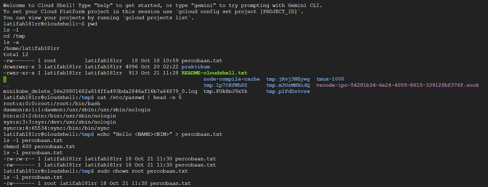

# Laporan Praktikum Minggu [3]
Topik: [Manajemen File dan Permission di Linux]

---

## Identitas
- **Nama**  : [Latifah Risti Anggraeni]  
- **NIM**   : [250202945]  
- **Kelas** : [1IKRB]

---

## Tujuan
1. Menggunakan perintah ls, pwd, cd, cat untuk navigasi file dan direktori.
2. Menggunakan chmod dan chown untuk manajemen hak akses file.
3. Menjelaskan hasil output dari perintah Linux dasar.
4. Menyusun laporan praktikum dengan struktur yang benar.
5. Mengunggah dokumentasi hasil ke Git Repository tepat waktu.

---

## Dasar Teori

### 1. Sistem Berkas Linux
Semua data tersimpan dalam struktur hierarki dimulai dari `/` (root).  
Direktori penting:
- `/home` → data pengguna  
- `/etc` → konfigurasi sistem  
- `/tmp` → file sementara  

### 2. Navigasi Sistem File
Perintah dasar:
- `pwd` → menampilkan direktori aktif  
- `ls` → melihat isi folder  
- `cd` → berpindah direktori  
- `cat` → membaca isi file  

### 3. Permission (Hak Akses)
Menentukan siapa yang bisa membaca, menulis, atau mengeksekusi file.  
Contoh:
- `rwx` → owner (read, write, execute)  
- `r-x` → group (read, execute)  
- `r--` → others (read only)

### 4. Ownership (Kepemilikan)
Setiap file punya **user** (pemilik) dan **group**.  
Perintah:  
- `chown` → ubah pemilik file  
- `chmod` → ubah hak akses file  

### 5. Peran chmod & chown
- `chmod` menjaga file agar hanya bisa diakses sesuai izin.  
- `chown` memastikan file dimiliki oleh user yang berwenang.  
Keduanya penting untuk **keamanan dan kontrol akses** di sistem Linux.

---

## Langkah Praktikum
1. **Setup Environment**
   - Gunakan Linux (Ubuntu/WSL).
   - Pastikan folder kerja berada di dalam direktori repositori Git praktikum:
     ```
     praktikum/week3-linux-fs-permission/
     ```

2. **Eksperimen 1 – Navigasi Sistem File**
   Jalankan perintah berikut:
   ```bash
   pwd
   ls -l
   cd /tmp
   ls -a
   ```
   - Jelaskan hasil tiap perintah.
   - Catat direktori aktif, isi folder, dan file tersembunyi (jika ada).

3. **Eksperimen 2 – Membaca File**
   Jalankan perintah:
   ```bash
   cat /etc/passwd | head -n 5
   ```
   - Jelaskan isi file dan struktur barisnya (user, UID, GID, home, shell).

4. **Eksperimen 3 – Permission & Ownership**
   Buat file baru:
   ```bash
   echo "Hello <NAME><NIM>" > percobaan.txt
   ls -l percobaan.txt
   chmod 600 percobaan.txt
   ls -l percobaan.txt
   ```
   - Analisis perbedaan sebelum dan sesudah chmod.  
   - Ubah pemilik file (jika memiliki izin sudo):
   ```bash
   sudo chown root percobaan.txt
   ls -l percobaan.txt
   ```
   - Catat hasilnya.

5. **Eksperimen 4 – Dokumentasi**
   - Ambil screenshot hasil terminal dan simpan di:
     ```
     praktikum/week3-linux-fs-permission/screenshots/
     ```
   - Tambahkan analisis hasil pada `laporan.md`.

6. **Commit & Push**
   ```bash
   git add .
   git commit -m "Minggu 3 - Linux File System & Permission"
   git push origin main
   ```

---

## Kode / Perintah
```bash
   pwd
   ls -l
   cd /tmp
   ls -a
   ```

```bash
   cat /etc/passwd | head -n 5
   ```

```bash
   echo "Hello <NAME><NIM>" > percobaan.txt
   ls -l percobaan.txt
   chmod 600 percobaan.txt
   ls -l percobaan.txt
   ```

---

## Hasil Eksekusi


---

## Analisis

## Eksperimen 1
- **Direktori aktif** ada dibagian `/home/latifah181rr`
- **Isi folder** ada dibagian `percobaan.txt`, `praktikum/`, `README-cloudshell.txt`
- **File tersembunyi** ada dibagian `.` dan `..`

Perintah `pwd`, `ls`, `cd`, dan `ls -a` digunakan untuk menavigasi sistem file dan menampilkan isi direktori, termasuk file tersembunyi.

---

## Eksperimen 2
- **Perintahnya** `cat /etc/passwd | head -n 5`
- **Isi file nya** data pengguna sistem (user account list)
- **Struktur baris**  
  `username:password:UID:GID:comment:home:shell`
- **Contoh:**  
  `root:x:0:0:root:/root:/bin/bash` 

File `/etc/passwd` menyimpan informasi dasar setiap user, termasuk direktori home dan shell yang digunakan.

---

## Eksperimen 3 
Pada eksperimen ini dibuat sebuah file baru bernama `percobaan.txt` menggunakan perintah:

```bash
echo "Hello Latifah181RR" > percobaan.txt
````

File tersebut awalnya memiliki izin akses:

```
-rw-rw-r--
```

Artinya **pemilik** dan **grup** dapat membaca serta menulis file, sedangkan **pengguna lain** hanya bisa membacanya.

Kemudian dijalankan perintah berikut untuk mengubah hak akses file:

```bash
chmod 600 percobaan.txt
```

Setelah perintah ini dijalankan, permission file berubah menjadi:

```
-rw-------
```

Perubahan ini membuat file hanya bisa **dibaca dan ditulis oleh pemiliknya**, sedangkan pengguna lain tidak memiliki akses sama sekali. Sehingga file lebih aman dan bersifat privat.

Selanjutnya, dilakukan perubahan kepemilikan file dengan perintah:

```bash
sudo chown root percobaan.txt
```

Hasilnya, kepemilikan file berpindah dari user `latifah181rr` menjadi `root`, namun hak aksesnya tetap sama (`-rw-------`).
Perubahan ini menunjukkan bahwa hanya **user root (administrator)** yang memiliki kontrol penuh atas file tersebut.

`chmod` mengatur hak akses file, sedangkan `chown` mengubah kepemilikan file. Keduanya berperan penting dalam menjaga keamanan dan kontrol akses pada sistem Linux.


---

## Kesimpulan


---

## Quiz
1. [Pertanyaan 1]  
   **Jawaban:**  
2. [Pertanyaan 2]  
   **Jawaban:**  
3. [Pertanyaan 3]  
   **Jawaban:**  

---

## Refleksi Diri
Tuliskan secara singkat:
- Apa bagian yang paling menantang minggu ini?  
- Bagaimana cara Anda mengatasinya?  

---

**Credit:**  
_Template laporan praktikum Sistem Operasi (SO-202501) – Universitas Putra Bangsa_
