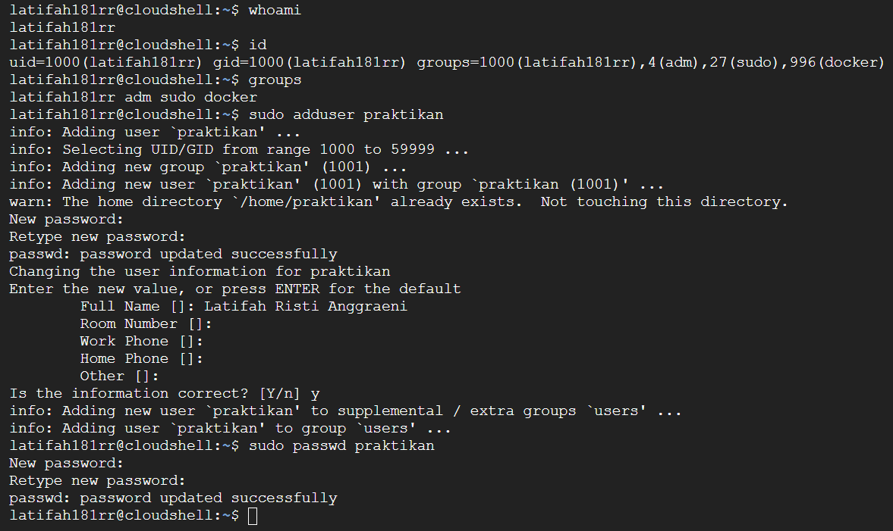
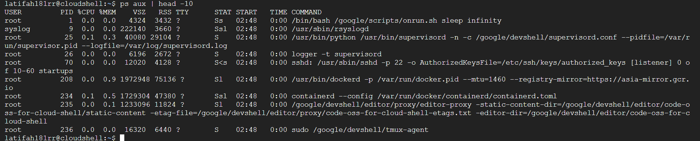
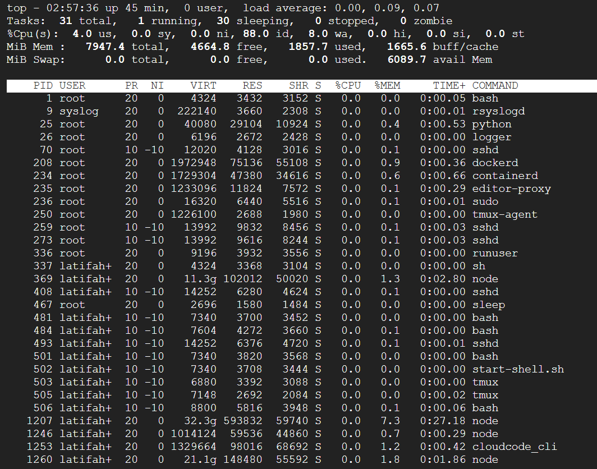
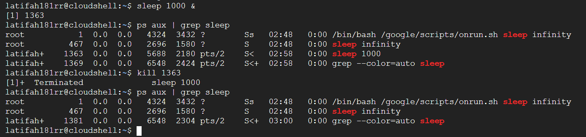
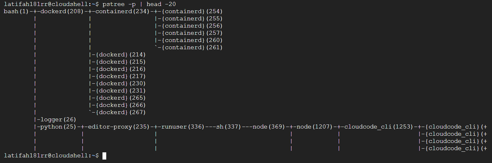

# Laporan Praktikum Minggu [4]
Topik: [Manajemen Proses dan User di Linux]

---

## Identitas
- **Nama**  : [Latifah Risti Anggraeni]  
- **NIM**   : [250202945]  
- **Kelas** : [1IKRB]
 
---

## Tujuan
1. Menjelaskan konsep proses dan user dalam sistem operasi Linux.  
2. Menampilkan daftar proses yang sedang berjalan dan statusnya.  
3. Menggunakan perintah untuk membuat dan mengelola user.  
4. Menghentikan atau mengontrol proses tertentu menggunakan PID.  
5. Menjelaskan kaitan antara manajemen user dan keamanan sistem.  


---

## Dasar Teori
1. Sistem Multiuser dan Hak Akses
Linux merupakan sebuah sistem operasi multiuser, yang artinya banyak pengguna yang dapat mengakses sistem secara bersamaan. Setiap pengguna akan memiliki User ID (UID) dan tergabung kedalam satu atau lebih group yang menentukan hak akses terhadap file, direktori, dan sumber daya sistem. Konsep permission (r, w, x) diterapkan untuk menjaga keamanan dan privasi para pengguna.

2. Manajemen User dan Group
Manajemen user mencakup pembuatan, penghapusan, serta pengaturan hak akses pengguna melalui perintah seperti `adduser`, `passwd`, `usermod`, dan `groups`. Administrator (root) bertanggung jawab untuk memastikan bahwa hanya pengguna yang berwenang yang dapat mengakses sumber daya tertentu. Struktur direktori `/etc/passwd`, `/etc/shadow`, dan `/etc/group` menyimpan informasi penting tentang akun pengguna dan grup.

3. Proses dan Manajemen Proses di Linux
Proses adalah program yang sedang dieksekusi. Setiap proses memiliki PID (Process ID) dan dapat diamati dengan menggunakan perintah seperti `ps`, `top`, dan `pstree`. Linux menggunakan hierarki proses, di mana proses induk (init atau systemd) dapat memiliki banyak proses anak. Manajemen proses mencakup pembuatan, pemantauan, serta penghentian proses dengan perintah seperti `kill`, `killall`, dan `sleep`. 

4. Peran init atau systemd dalam Sistem 
`systemd` adalah proses pertama (PID 1) yang dijalankan setelah kernel aktif. Bertanggung jawab untuk menginisialisasi layanan, mengatur proses, serta mengelola booting dan shutdown sistem. Semua proses lain di sistem merupakan turunan dari systemd.

5. Keamanan Sistem Linux
Keamanan dijaga melalui pembatasan hak akses, autentikasi pengguna, dan penggunaan akun root secara terbatas. Dengan sistem hak akses yang ketat, Linux dapat mencegah pengguna tidak sah melakukan perubahan pada konfigurasi sistem atau file penting.

---

## Langkah Praktikum
1. **Setup Environment**
   - Gunakan Linux (Ubuntu/WSL).  
   - Pastikan Anda sudah login sebagai user non-root.  
   - Siapkan folder kerja:
     ```
     praktikum/week4-proses-user/
     ```

2. **Eksperimen 1 – Identitas User**
   Jalankan perintah berikut:
   ```bash
   whoami
   id
   groups
   ```
   - Jelaskan setiap output dan fungsinya.  
   - Buat user baru (jika memiliki izin sudo):
     ```bash
     sudo adduser praktikan
     sudo passwd praktikan
     ```
   - Uji login ke user baru.

3. **Eksperimen 2 – Monitoring Proses**
   Jalankan:
   ```bash
   ps aux | head -10
   top -n 1
   ```
   - Jelaskan kolom penting seperti PID, USER, %CPU, %MEM, COMMAND.  
   - Simpan tangkapan layar `top` ke:
     ```
     praktikum/week4-proses-user/screenshots/top.png
     ```

4. **Eksperimen 3 – Kontrol Proses**
   - Jalankan program latar belakang:
     ```bash
     sleep 1000 &
     ps aux | grep sleep
     ```
   - Catat PID proses `sleep`.  
   - Hentikan proses:
     ```bash
     kill <PID>
     ```
   - Pastikan proses telah berhenti dengan `ps aux | grep sleep`.

5. **Eksperimen 4 – Analisis Hierarki Proses**
   Jalankan:
   ```bash
   pstree -p | head -20
   ```
   - Amati hierarki proses dan identifikasi proses induk (`init`/`systemd`).  
   - Catat hasilnya dalam laporan.

6. **Commit & Push**
   ```bash
   git add .
   git commit -m "Minggu 4 - Manajemen Proses & User"
   git push origin main
   ```

---

## Kode / Perintah
 ```bash
   whoami
   id
   groups
   ```

   ```bash
     sudo adduser praktikan
     sudo passwd praktikan
   ```

 ```bash
   ps aux | head -10
   top -n 1
   ```

   ```bash
     sleep 1000 &
     ps aux | grep sleep
   ```

 ```bash
   pstree -p | head -20
   ```


---

## Hasil Eksekusi
Sertakan screenshot hasil percobaan atau diagram:










---

## Analisis
# Eksperimen 1
- Perintah `whoami`, hasil output `latifah181rr` berfungsi untuk memastikan siapa pengguna yang sedang menjalankan perintah, terutama disaat ada banyaknya user di sistem yang sama.

- Perintah `id`, hasil output `uid=1000(latifah181rr) gid=1000(latifah181rr) groups=1000(latifah181rr),4(adm),27(sudo),996(docker)` berfungsi untuk menampilkan identitas pengguna lengkap di sistem.

- Perintah `groups`, hasil output `latifah181rr adm sudo docker` berfungsi memudahkan pengguna untuk mengetahui hak akses apa saja yang pengguna miliki melalui keanggotaan grup tersebut.

# Eksperimen 2
- **PID (Process ID)** akan digunakan untuk mengidentifikasi dan mengontrol proses

- **USER** biasannya menunjukkan siapa pemilik proses yang berguna untuk membedakan proses milik sistem dan milik user biasa.

- **%CPU** adalah persentase penggunaan CPU oleh proses tersebut untuk menunjukkan proses mana yang paling banyak memakai tenaga prosesor.

- **%MEM** merupakan persentase penggunaan RAM oleh proses untuk menunjukkan seberapa besar memori yang digunakan proses tersebut dibanding total RAM sistem.

- **COMMAND** merupakan nama program atau perintah yang sedang dijalankan oleh proses yang bertujuan untuk menunjukkan proses apa yang dilakukan sistem.

# Eksperimen 3
PID Proses `sleep`nya yaitu **PID = 1363**. Proses tersebut dibuat dengan menjalankan perintah `sleep 1000 &` dilanjut dengan perintah `kill 1363` dan status berubah menjadi `[1]+  Terminated  sleep 1000`.

# Eksperimen 4
Proses induknya adalah `bash (PID 1)`, bertindak sebagai pengganti `init/systemd` di dalam container Cloud Shell. Semua proses lain seperti `dockerd`, `python`, `editor-proxy`, `node`, dll. merupakan anak dari `bash(1)` secara langsung atau tidak langsung.

---

## Kesimpulan
1. Manajemen pengguna berperan penting dalam menjaga keamanan dan pengaturan akses sistem Linux. Dengan perintah seperti `adduser`, `passwd`, dan `groups`, administrator dapat mengatur hak akses dan tanggung jawab pada setiap pengguna secara terpisah.

2. Manajemen proses memungkinkan pengguna untuk memantau, mengontrol, dan menghentikan proses yang berjalan di sistem menggunakan perintah seperti `ps`, `top`, `kill`, dan `pstree`. Hal ini penting untuk menjaga stabilitas dan efisiensi sistem.

3. `root` bertindak sebagai administrator dengan hak penuh, sedangkan `systemd` bertugas sebagai proses induk yang mengatur seluruh proses dan layanan sistem sejak sistem di-boot hingga dimatikan.

---

## Tugas
# Fungsi Setiap Perintah

- `whoami` berfungsi untuk menampilkan nama user yang sedang login ke sistem. 
- `id` berfungsi untuk menampilkan UID (User ID), GID (Group ID), dan daftar grup yang diikuti user.
- `groups` berfungsi untuk menampilkan daftar grup yang diikuti oleh user saat ini.
- `sudo adduser praktikan` berfungsi untuk membuat user baru bernama `praktikan`.
- `sudo passwd praktikan` berfungsi untuk mengubah atau memperbarui password user praktikan.

---


- `ps aux | head -10` berfungsi untuk menampilkan daftar proses yang sedang berjalan (`ps aux`) dan hanya menampilkan 10 baris pertama (`head -10`).

---


- `top` berfungsi untuk menampilkan daftar proses yang berjalan secara real-time, beserta penggunaan CPU, memori, load average, dsb.

---


- `sleep 1000 &` berfungsi untuk menjalankan proses `sleep` selama 1000 detik di background (`&`).
- `ps aux | grep sleep` berfungsi untuk menampilkan semua proses yang mengandung kata `sleep`.
- `kill 1363` berfungsi untuk menghentikan proses dengan PID 1363.

---


- `pstree -p | head -20` berfungsi untuk menampilkan proses dalam bentuk pohon (`tree`) beserta PID masing-masing (`-p`), lalu hanya 20 baris pertama yang ditampilkan (`head -20`).

---

# Gambar Hierarki Proses Dalam Bentuk Biagram Pohon (`pstree`)


---

# Hubungan Antara User Management dan Keamanan Sistem Linux. 
- **Pembatasan Hak Akses (Principle of Least Privilege)**

Setiap user hanya diberikan hak akses sesuai kebutuhan. Misalnya, user biasa tidak memiliki akses ke konfigurasi sistem (`/etc`, `/root`), hanya `root` atau anggota `sudo` yang bisa. Hal ini mencegah kesalahan atau eksploitasi yang dapat merusak sistem.

- **Isolasi Pengguna dan Data**

Setiap user memiliki direktori pribadi (`/home/<username>`) yang hanya bisa diakses oleh pemiliknya. Proses milik satu user tidak bisa mengendalikan proses user lain. Ini memastikan kerahasiaan data antar pengguna dan stabilitas sistem.

- **Autentikasi dan Pengendalian Akses**

Linux menggunakan sistem password terenkripsi (`/etc/shadow`). Administrator dapat mengatur kebijakan password kuat, masa berlaku, dan blokir akun yang tidak aktif. Mengurangi risiko peretasan akun melalui brute-force atau credential theft.

- **Kelompok (Group) untuk Pengelolaan Izin**

Grup digunakan untuk memberikan akses bersama ke file atau direktori tanpa membuka akses ke semua user. Contohnya grup `docker` hanya untuk user yang boleh menjalankan perintah Docker.

- **Auditing dan Logging**

Setiap aktivitas user bisa dicatat di log sistem (`/var/log/auth.log`, `last`, `lastlog`). Dapat digunakan untuk mendeteksi aktivitas mencurigakan atau pelanggaran akses. Bertujuan untuk mendukung accountability dan forensik keamanan.

- **Penggunaan User Khusus untuk Layanan (System Users)**

Proses sistem seperti `www-data` untuk web server atau `mysql` untuk database dijalankan dengan user non-root. Bertujuan untuk membatasi dampak jika layanan tersebut diretas atau tidak bisa mengakses seluruh sistem.

---

## Quiz
1. [Apa fungsi dari proses `init` atau `systemd` dalam sistem Linux? ]  
   **Jawaban:** Berfungsi untuk menginisialisasi sistem saat booting, menjalankan layanan, dan menjadi induk dari semua proses di Linux.

2. [Apa perbedaan antara `kill` dan `killall`?]  
   **Jawaban:** `kill` menghentikan proses berdasarkan PID, sedangkan `killall` menghentikan semua proses dengan nama program yang sama.

3. [Mengapa user `root` memiliki hak istimewa di sistem Linux?]  
   **Jawaban:** Karena `root` adalah administrator utama yang memiliki akses penuh untuk mengelola dan mengubah seluruh sistem Linux.

---

## Refleksi Diri
Bagian paling menantang saat mencoba memahami manajemen proses dan hierarki systemd, terutama cara kerja proses induk dan anak serta bagaimana menghentikan proses tanpa memengaruhi sistem lain. Cara untuk mengatasinya dengan membaca dokumentasi Linux, mencoba langsung perintah seperti `ps`, `pstree`, dan `kill`, serta mencatat hasilnya untuk lebih memahami hubungan antarproses dengan lebih jelas.

---

**Credit:**  
_Template laporan praktikum Sistem Operasi (SO-202501) – Universitas Putra Bangsa_
