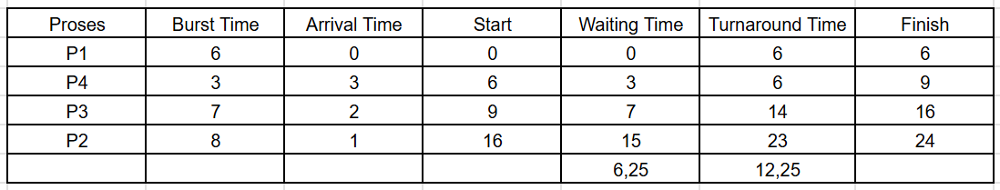

# Laporan Praktikum Minggu 5
Topik: Penjadwalan CPU – FCFS dan SJF

---

## Identitas
- **Nama**  : Latifah Risti Anggraeni
- **NIM**   : 250202945
- **Kelas** : 1IKRB

---

## Tujuan
1. Menghitung *waiting time* dan *turnaround time* untuk algoritma FCFS dan SJF.  
2. Menyajikan hasil perhitungan dalam tabel yang rapi dan mudah dibaca.  
3. Membandingkan performa FCFS dan SJF berdasarkan hasil analisis.  
4. Menjelaskan kelebihan dan kekurangan masing-masing algoritma.  
5. Menyimpulkan kapan algoritma FCFS atau SJF lebih sesuai digunakan.  

---

## Dasar Teori
1. Penjadwalan CPU adalah mekanisme sistem operasi memiliki tugas sebagai penentu urutan eksekusi proses yang terdapat dalam antrian siap. Bertujuan untuk memaksimalkan penggunaan CPU dan meminimalkan waktu tunggu proses.

2. FCFS mengeksekusi proses berdasarkan urutan kedatangan. Proses yang datang lebih dulu akan dijalankan lebih dahulu. Algoritma ini sederhana dan adil, tetapi dapat menyebabkan convoy effect, yaitu proses pendek menunggu lama karena proses panjang dijalankan lebih dulu.

3. SJF akan memilih proses dengan waktu eksekusi yang paling pendek di antara proses yang sudah siap. Algoritma ini menghasilkan waktu tunggu dan waktu penyelesaian rata-rata yang paling kecil, tetapi berisiko menyebabkan starvation bagi proses yang memiliki waktu eksekusi paling panjang. 

4. **Waiting Time (WT)** adalah waktu proses menunggu sebelum mendapatkan CPU sedangkan **Turnaround Time (TAT)** merupakan total waktu sejak proses tiba sampai selesai **(TAT = WT + Burst Time)**. Nilai WT dan TAT digunakan untuk menilai efisiensi algoritma.

5. Percobaan ini memiliki tujuan untuk membandingkan performa FCFS dan SJF melalui perhitungan WT dan TAT. Algoritma yang rata-rata WT dan TAT-nya lebih kecil akan dianggap memiliki performa penjadwalan yang lebih efisien.

---

## Langkah Praktikum
1. **Siapkan Data Proses**
   Gunakan tabel proses berikut sebagai contoh (boleh dimodifikasi dengan data baru):
   | Proses | Burst Time | Arrival Time |
   |:--:|:--:|:--:|
   | P1 | 6 | 0 |
   | P2 | 8 | 1 |
   | P3 | 7 | 2 |
   | P4 | 3 | 3 |

2. **Eksperimen 1 – FCFS (First Come First Served)**
   - Urutkan proses berdasarkan *Arrival Time*.  
   - Hitung nilai berikut untuk tiap proses:
     ```
     Waiting Time (WT) = waktu mulai eksekusi - Arrival Time
     Turnaround Time (TAT) = WT + Burst Time
     ```
   - Hitung rata-rata Waiting Time dan Turnaround Time.  
   - Buat Gantt Chart sederhana:  
     ```
     | P1 | P2 | P3 | P4 |
     0    6    14   21   24
     ```

3. **Eksperimen 2 – SJF (Shortest Job First)**
   - Urutkan proses berdasarkan *Burst Time* terpendek (dengan memperhatikan waktu kedatangan).  
   - Lakukan perhitungan WT dan TAT seperti langkah sebelumnya.  
   - Bandingkan hasil FCFS dan SJF pada tabel berikut:

     | Algoritma | Avg Waiting Time | Avg Turnaround Time | Kelebihan | Kekurangan |
     |------------|------------------|----------------------|------------|-------------|
     | FCFS | ... | ... | Sederhana dan mudah diterapkan | Tidak efisien untuk proses panjang |
     | SJF | ... | ... | Optimal untuk job pendek | Menyebabkan *starvation* pada job panjang |

4. **Eksperimen 3 – Visualisasi Spreadsheet (Opsional)**
   - Gunakan Excel/Google Sheets untuk membuat perhitungan otomatis:
     - Kolom: Arrival, Burst, Start, Waiting, Turnaround, Finish.
     - Gunakan formula dasar penjumlahan/subtraksi.
   - Screenshot hasil perhitungan dan simpan di:
     ```
     praktikum/week5-scheduling-fcfs-sjf/screenshots/
     ```

5. **Analisis**
   - Bandingkan hasil rata-rata WT dan TAT antara FCFS & SJF.  
   - Jelaskan kondisi kapan SJF lebih unggul dari FCFS dan sebaliknya.  
   - Tambahkan kesimpulan singkat di akhir laporan.

6. **Commit & Push**
   ```bash
   git add .
   git commit -m "Minggu 5 - CPU Scheduling FCFS & SJF"
   git push origin main
   ```

---

## Kode / Perintah
| Proses | Burst Time | Arrival Time |
   |:--:|:--:|:--:|
   | P1 | 6 | 0 |
   | P2 | 8 | 1 |
   | P3 | 7 | 2 |
   | P4 | 3 | 3 |

 ```
Waiting Time (WT) = waktu mulai eksekusi - Arrival Time
Turnaround Time (TAT) = WT + Burst Time
 ```

 ```
 | P1 | P2 | P3 | P4 |
 0    6    14   21   24
```

 ```
 | P1 | P4 | P3 | P2 |
 0    6    9   16   24
```

```
=SUM | =AVERAGE
```

---

## Hasil Eksekusi
# FCFS

Gantt Chart sederhana:
```
 | P1 | P2 | P3 | P4 |
 0    6    14   21   24
```

# SJF

Gantt Chart sederhana:
```
 | P1 | P4 | P3 | P2 |
 0    6    9   16   24
```

| Algoritma | Avg Waiting Time | Avg Turnaround Time | Kelebihan | Kekurangan |
|------------|------------------|----------------------|------------|-------------|
| FCFS | 8,75 | 14,75 | Sederhana dan mudah diterapkan | Tidak efisien untuk proses panjang |
| SJF | 6,25 | 12,25 | Optimal untuk job pendek | Menyebabkan *starvation* pada job panjang |

---

## Analisis
SJF menghasilkan rata-rata WT dan TAT yang lebih rendah dari pada FCFS. Untuk efisiensi waktu proses selesai secara keseluruhan, SJF lebih baik dibandingkan FCFS. 

SJF lebih unggul dari pada FCFS pada saat tujuan utama sistem adalah efisiensi dan hasil yang bisa mendekati optimal, biasanya waktu eksekusi proses didahulukan dari  yang paling pendek dan tiba secara bersamaan. 

FCFS lebih unggul dari SJF ketika FCFS mengeksekusi proses sesuai urutan kedatangan atau bisa dikatakan secara adil, tidak ada perbedaan antar burst time dan di mana prioritas berdasarkan waktu kedatangan penting.

---

## Kesimpulan
1. FCFS geksekusi proses berasarkan urutan kedatangan, lebih sederhana dan adil. Akan tetapi kurang efisien karena waktu eksekusi lebih lama.

2. SJF memilih proses eksekusi dari yang paling pendek terlebih dahulu, sehingga lebih efisien.

3. SJF memperlihatkan performa yang lebih baik dengan efisiensi waktu CPU sedangkan FCFS unggul dalam kesederhanaan dan keadilan penjadwalan.

---

# Tugas
### FCFS

Gantt Chart sederhana:
```
 | P1 | P2 | P3 | P4 |
 0    6    14   21   24
```

### SJF

Gantt Chart sederhana:
```
 | P1 | P4 | P3 | P2 |
 0    6    9   16   24
```

| Algoritma | Avg Waiting Time | Avg Turnaround Time | Kelebihan | Kekurangan |
|------------|------------------|----------------------|------------|-------------|
| FCFS | 8,75 | 14,75 | Sederhana dan mudah diterapkan | Tidak efisien untuk proses panjang |
| SJF | 6,25 | 12,25 | Optimal untuk job pendek | Menyebabkan *starvation* pada job panjang |

### Kelebihan dan Kekurangan
- FCFS sederhana dan adil, akan tetapi tidak optimal untuk metrik rata-rata waktu.
- SJF lebih efisien, tetapi risiko starvation untuk job akan lebih panjang pada saat job pendek baru telah ada.

---

## Quiz
1. [Apa perbedaan utama antara FCFS dan SJF?]  
   **Jawaban:**  
   FCFS menjadwalkan proses berdasarkan urutan kedatangan sedangkan SJF memilih proses dengan mendahulukan waktu eksekusi yang paling terpendek.

2. [Mengapa SJF dapat menghasilkan rata-rata waktu tunggu minimum?]  
   **Jawaban:**  
   Karena dengan mendahulukan waktu eksekusi yang terpendek sehingga proses-proses kecil tidak perlu menunggu proses besar.

3. [Apa kelemahan SJF jika diterapkan pada sistem interaktif?]  
   **Jawaban:**  
   Sulit memprediksi waktu eksekusi proses dengan akurat, dan proses yang memiliki waktu eksekusi panjang bisa tertunda terus-menerus.

---

## Refleksi Diri
Bagian menantang yaitu menentukan Start Time dan Finish Time pada perhitungan algoritma SJF. Masih bingung bagaimana cara proses waktu eksekusi paling pendek dapat memengaruhi urutan eksekusi dan waktu tunggu proses lain. Untuk mengatasinya dengan cara membuat diagram Gantt dan menghitung di setiap langkah. 

---

**Credit:**  
_Template laporan praktikum Sistem Operasi (SO-202501) – Universitas Putra Bangsa_
