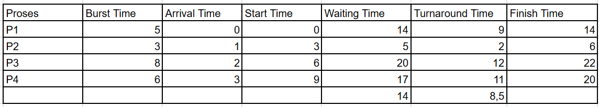
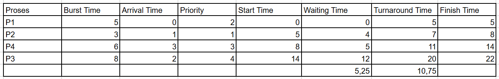

# Laporan Praktikum Minggu 6
Topik: Penjadwalan CPU – Round Robin (RR) dan Priority Scheduling

---

## Identitas
- **Nama**  : Latifah Risti Anggraeni  
- **NIM**   : 250202945  
- **Kelas** : 1IKRB

---

## Tujuan
1. Menghitung *waiting time* dan *turnaround time* pada algoritma RR dan Priority.  
2. Menyusun tabel hasil perhitungan dengan benar dan sistematis.  
3. Membandingkan performa algoritma RR dan Priority.  
4. Menjelaskan pengaruh *time quantum* dan prioritas terhadap keadilan eksekusi proses.  
5. Menarik kesimpulan mengenai efisiensi dan keadilan kedua algoritma.  

---

## Dasar Teori
1. Round Robin menggunakan konsep time quantum, yaitu batas waktu kecil yang diberikan kepada setiap proses untuk di eksekusi. Jika proses belum selesai pada saat quantum telah habis, maka proses tersebut akan dimasukkan ke antrian kembali.
2. Priority Scheduling mengeksekusi proses berdasarkan tingkat prioritas, Angka prioritas yang lebih kecil akan didahulukan atau di prioritaskan lebih dulu. Priority Scheduling bersifat preemptive dan non preemptive.
3. Round Robin lebih adil dengan membagi waktu CPU secara merata sedangkan Priority Scheduling lebih efisien untuk proses penting.

---

## Langkah Praktikum
1. **Siapkan Data Proses**
   Gunakan contoh data berikut (boleh dimodifikasi sesuai kebutuhan):
   | Proses | Burst Time | Arrival Time | Priority |
   |:--:|:--:|:--:|:--:|
   | P1 | 5 | 0 | 2 |
   | P2 | 3 | 1 | 1 |
   | P3 | 8 | 2 | 4 |
   | P4 | 6 | 3 | 3 |

2. **Eksperimen 1 – Round Robin (RR)**
   - Gunakan *time quantum (q)* = 3.  
   - Hitung *waiting time* dan *turnaround time* untuk tiap proses.  
   - Simulasikan eksekusi menggunakan Gantt Chart (manual atau spreadsheet).  
     ```
     | P1 | P2 | P3 | P4 | P1 | P3 | ...
     0    3    6    9   12   15   18  ...
     ```
   - Catat sisa *burst time* tiap putaran.

3. **Eksperimen 2 – Priority Scheduling (Non-Preemptive)**
   - Urutkan proses berdasarkan nilai prioritas (angka kecil = prioritas tinggi).  
   - Lakukan perhitungan manual untuk:
     ```
     WT[i] = waktu mulai eksekusi - Arrival[i]
     TAT[i] = WT[i] + Burst[i]
     ```
   - Buat tabel perbandingan hasil RR dan Priority.

4. **Eksperimen 3 – Analisis Variasi Time Quantum (Opsional)**
   - Ubah *quantum* menjadi 2 dan 5.  
   - Amati perubahan nilai rata-rata *waiting time* dan *turnaround time*.  
   - Buat tabel perbandingan efek *quantum*.

5. **Eksperimen 4 – Dokumentasi**
   - Simpan semua hasil tabel dan screenshot ke:
     ```
     praktikum/week6-scheduling-rr-priority/screenshots/
     ```
   - Buat tabel perbandingan seperti berikut:

     | Algoritma | Avg Waiting Time | Avg Turnaround Time | Kelebihan | Kekurangan |
     |------------|------------------|----------------------|------------|-------------|
     | RR | ... | ... | Adil terhadap semua proses | Tidak efisien jika quantum tidak tepat |
     | Priority | ... | ... | Efisien untuk proses penting | Potensi *starvation* pada prioritas rendah |

6. **Commit & Push**
   ```bash
   git add .
   git commit -m "Minggu 6 - CPU Scheduling RR & Priority"
   git push origin main
   ```

---

## Kode / Perintah

| Proses | Burst Time | Arrival Time | Priority |
|:--:|:--:|:--:|:--:|
| P1 | 5 | 0 | 2 |
| P2 | 3 | 1 | 1 |
| P3 | 8 | 2 | 4 |
| P4 | 6 | 3 | 3 |


```
     | P1 | P2 | P3 | P4 | P1 | P3 | ...
     0    3    6    9   12   15   18  ...
```
```
     WT[i] = waktu akhir eksekusi - Arrival[i]
     TAT[i] = WT[i] - Burst[i]
```

```
     | P1 | P2 | P4 | P3 | 
     0    5    8    14   22 
```

```
     WT[i] = waktu mulai eksekusi - Arrival[i]
     TAT[i] = WT[i] + Burst[i]
```

```
=SUM | =AVERAGE
```

---

## Hasil Eksekusi
# Round Robin


```
     | P1 | P2 | P3 | P4 | P1 | P3 | ...
     0    3    6    9   12   15   18  ...
```

# Priority Scheduling (Non-Preemptive)

```
     | P1 | P2 | P4 | P3 | 
     0    5    8    14   22 
```

# Perbandingan
| Algoritma | Avg Waiting Time | Avg Turnaround Time | Kelebihan | Kekurangan |
 |------------|------------------|----------------------|------------|-------------|
| RR | 14 | 8,5 | Adil terhadap semua proses | Tidak efisien jika quantum tidak tepat |
| Priority | 5,25 | 10,75 | Efisien untuk proses penting | Potensi *starvation* pada prioritas rendah |

---

## Analisis
- Pada percobaan Round Robin (q=3), rata rata WT dan TAT lebih tinggi dibandingkan Priority Scheduling. Sesuai teori bahwa Round Roubin telah membagi CPU secara rata. Tetapi proses tersebut harus menunggu beberapa putaran sampai gilirannya kembali. Seperti P3 dan P4 mengalami antrian berkali kali mengakibatkan proses menjadi lebih panjang.

- Pecobaan Priority Scheduling Non Preemptive menunjukkan rata rata waiting time yang lebih kecil. Hal tersebut di karenakan proses dengan prioritas tinggi langsung dijalankan begitu CPU tersedia. Misalnya P2 dengan perioritas 1 yang dieksekusi lebih awal, tidak seperti Round Robin, Priority Scheduling Non Preemptive ini tidak terjebak dalam antrian berkali-kali. 

- Hasil dari percobaan tersebut menunjukkan Round Robin memberikan kesempatan adil, cocok untuk time sharing sedangkan Priority Scheduling memberikan respons lebih cepat untuk proses penting, cocok untuk sistem real-time atau layanan yang harus didahulukan.
 
---

## Kesimpulan
- Algoritma Round Robin memberikan keadilan dalam pembagian waktu CPU, akan tetapi waiting time dan turnaround time menjadi lebih besar karena proses eksekusi bergiliran dan terputus-putus oleh time quantum. 
- Algoritma Priority Scheduling mampu menghasilkan waiting time dan turnaround time yang lebih rendah karena proses dengan prioritas tinggi dieksekusi terlebih dahulu dan berjalan hingga selesai tanpa preemption.
- Perbedaan hasil kedua algoritma membuktikan bahwa performa penjadwalan bergantung pada mekanisme yang digunakan. Round Robin lebih cocok untuk sistem interaktif dan time-sharing, sedangkan Priority Scheduling lebih efisien untuk sistem yang memerlukan pemrosesan berdasarkan tingkat kepentingan.

---

## Quiz
1. Apa perbedaan utama antara Round Robin dan Priority Scheduling?  
   **Jawaban:**  
   Round Robin membagi waktu CPU secara merata menggunakan time quantum sedangkan Priority Scheduling menentukan urutan eksekusi berdasarkan tingkat prioritas proses, bukan berdasarkan giliran.

2. Apa pengaruh besar/kecilnya *time quantum* terhadap performa sistem?   
   **Jawaban:**  
   Time quantum yang lebih kecil akan membuat sistem lebih sering melakukan pindah tugas akibatnya akan membuat waktu terbuang banyak dan lebih lambat, sementara time quantum yang lebih besar jarang melakukan pindah tugas sehingga waktu respons untuk pekerjaan pendek menjadi lebih lama.
   
3. Mengapa algoritma Priority dapat menyebabkan *starvation*?  
   **Jawaban:**  
   Karena algoritma Priority selalu memilih proses dengan prioritas tertinggi sehingga proses dengan prioritas rendah kemungkinan tidak akan mendapatkan giliran apabila proses dengan prioritas tinggi terus menerus datang dan mengambil sumber daya secara berkelanjutan.

---

## Refleksi Diri
Kesulitan kali ini yaitu menentukan start untuk algoritma Priority Scheduling (Non-Preemptive), solusinya dengan memastikan CPU kosong dan memilih proses dengan prioritas tertinggi dari antrean siap. Setelah menentukan waktu mulai untuk setiap proses berdasarkan prioritas, langkah berikutnya adalah membuat Gantt Chart.

---

**Credit:**  
_Template laporan praktikum Sistem Operasi (SO-202501) – Universitas Putra Bangsa_
