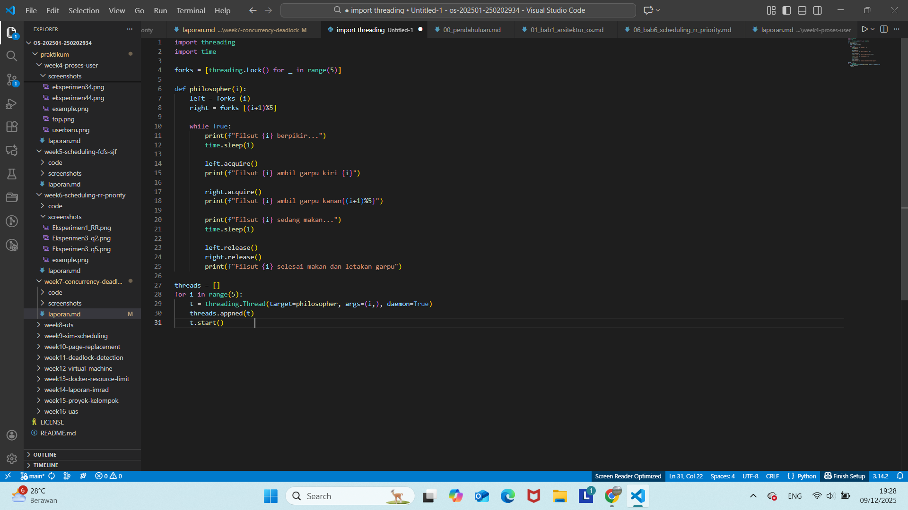
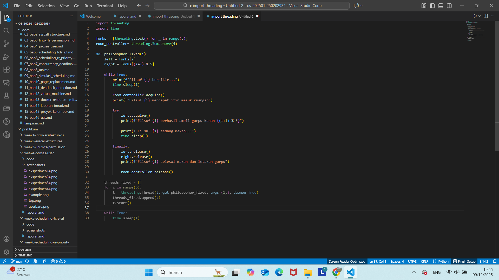

# Laporan Praktikum Minggu [7]
Topik: Sinkronisasi Proses dan Masalah Deadlock

---

## Identitas
- **Nama**/**NIM**   : 
1. Latifah Risti Anggraeni (250202945)
2. Nisa'ul Hidayah (250202981) 
3. Dyah Retno Wulandari (250202934)
- **Kelas** : [1IKRB]

---

## Tujuan
1. Mengidentifikasi empat kondisi penyebab deadlock (*mutual exclusion, hold and wait, no preemption, circular wait*).  
2. Menjelaskan mekanisme sinkronisasi menggunakan *semaphore* atau *monitor*.  
3. Menganalisis dan memberikan solusi untuk kasus deadlock.  
4. Berkolaborasi dalam tim untuk menyusun laporan analisis.  
5. Menyajikan hasil studi kasus secara sistematis.  

---

## Dasar Teori
Sinkronisasi proses adalah cara komputer mengatur beberapa proses (program yang sednag berejalan) agar tidaksaling bentrok ketika memakai resource yang sama. Masalah deadloc adalah kondisi ketika dua atau lebih proses saling menunggu saty samsa lain,sehungga semuanya tidak bisa lanjut semuanya.
---

## Langkah Praktikum
1. **Persiapan Tim**
   - Bentuk kelompok beranggotakan 3–4 orang.  
   - Tentukan ketua dan pembagian tugas (analisis, implementasi, dokumentasi).

2. **Eksperimen 1 – Simulasi Dining Philosophers (Deadlock Version)**
   - Implementasikan versi sederhana dari masalah *Dining Philosophers* tanpa mekanisme pencegahan deadlock.  
   - Contoh pseudocode:
     ```text
     while true:
       think()
       pick_left_fork()
       pick_right_fork()
       eat()
       put_left_fork()
       put_right_fork()
     ```
   - Jalankan simulasi atau analisis alur (boleh menggunakan pseudocode atau diagram alur).  
   - Identifikasi kapan dan mengapa deadlock terjadi.

3. **Eksperimen 2 – Versi Fixed (Menggunakan Semaphore / Monitor)**
   - Modifikasi pseudocode agar deadlock tidak terjadi, misalnya:
     - Menggunakan *semaphore (mutex)* untuk mengontrol akses.
     - Membatasi jumlah filosof yang dapat makan bersamaan (max 4).  
     - Mengatur urutan pengambilan garpu (misal, filosof terakhir mengambil secara terbalik).  
   - Analisis hasil modifikasi dan buktikan bahwa deadlock telah dihindari.

4. **Eksperimen 3 – Analisis Deadlock**
   - Jelaskan empat kondisi deadlock dari versi pertama dan bagaimana kondisi tersebut dipecahkan pada versi fixed.  
   - Sajikan hasil analisis dalam tabel seperti contoh berikut:

     | Kondisi Deadlock | Terjadi di Versi Deadlock | Solusi di Versi Fixed |
     |------------------|---------------------------|------------------------|
     | Mutual Exclusion | Ya (satu garpu hanya satu proses) | Gunakan semaphore untuk kontrol akses |
     | Hold and Wait | Ya | Hindari proses menahan lebih dari satu sumber daya |
     | No Preemption | Ya | Tidak ada mekanisme pelepasan paksa |
     | Circular Wait | Ya | Ubah urutan pengambilan sumber daya |

5. **Eksperimen 4 – Dokumentasi**
   - Simpan semua diagram, screenshot simulasi, dan hasil diskusi di:
     ```
     praktikum/week7-concurrency-deadlock/screenshots/
     ```
   - Tuliskan laporan kelompok di `laporan.md` (format IMRaD singkat: *Pendahuluan, Metode, Hasil, Analisis, Diskusi*).

6. **Commit & Push**
   ```bash
   git add .
   git commit -m "Minggu 7 - Sinkronisasi Proses & Deadlock"
   git push origin main
   ```

---

## Kode / Perintah
```text
     while true:
       think()
       pick_left_fork()
       pick_right_fork()
       eat()
       put_left_fork()
       put_right_fork()
```

```import threading
import time

forks = [threading.Lock() for _ in range(5)]

def philosopher(i):
    left = forks[i]
    right = forks[(i + 1) % 5]

    while True:
        print(f"Filsuf {i} berpikir...")
        time.sleep(1)

        left.acquire()
        print(f"Filsuf {i} ambil garpu kiri {i}")

        right.acquire()
        print(f"Filsuf {i} ambil garpu kanan {(i + 1) % 5}")

        print(f"Filsuf {i} sedang makan...")
        time.sleep(1)

        left.release()
        right.release()
        print(f"Filsuf {i} selesai makan dan letakan garpu")

threads = []
for i in range(5):
    t = threading.Thread(target=philosopher, args=(i,), daemon=True)
    threads.append(t)
    t.start()
```

```import threading
import time

forks = [threading.Lock() for _ in range(5)]
room_controller = threading.Semaphore(4)

def philosopher_fixed(i):
    left = forks[i]
    right = forks[(i + 1) % 5]

    while True:
        print(f"Filsuf {i} berpikir...")
        time.sleep(1)

        room_controller.acquire()
        print(f"Filsuf {i} mendapat izin masuk ruangan")
        
        try:
            left.acquire()
            print(f"Filsuf {i} berhasil ambil garpu kiri {i}")

            right.acquire()
            print(f"Filsuf {i} berhasil ambil garpu kanan {(i + 1) % 5}")

            print(f"Filsuf {i} sedang makan...")
            time.sleep(1)

        finally:
            left.release()
            right.release()
            print(f"Filsuf {i} selesai makan dan letakan garpu")

            room_controller.release()


threads_fixed = []
for i in range(5):
    t = threading.Thread(target=philosopher_fixed, args=(i,), daemon=True)
    threads_fixed.append(t)
    t.start()

while True:
    time.sleep(1)
```

---

## Hasil Eksekusi
Eksperimen 1


Eksperimen 2


---

## Analisis
1. Deadlock muncul setelah setiap filsuf berhasil mengambil garpu kiri, lalu semuanya menunggu garpu kanan yang sedang dipegang orang lain. Deadlock terjadi karena setiap filsuf mengambil garpu dengan urutan yang sama (kiri dulu, lalu kanan)  

2. Modifikasi yang memperkenalkan room_controller (Semaphore dengan nilai N-1, yaitu 4) berhasil mencegah deadlock secara efektif. Semaphore (room_controller) bertindak sebagai pelayan yang membatasi hanya maksimal 4 filsuf yang boleh berada di meja (mencoba mengambil garpu) secara bersamaan. Dengan hanya mengizinkan N-1 filsuf untuk mencoba makan, selalu ada setidaknya satu garpu bebas yang tidak dapat ditahan oleh semua filsuf secara kolektif. Keterbatasan ini menjamin bahwa filsuf terakhir yang masuk (misalnya P_3, jika 4 filsuf sudah masuk) pasti dapat mengambil kedua garpunya (F_3 dan F_4 dalam contoh ini) tanpa menunggu garpu yang ditahan oleh filsuf lain. Setelah filsuf ini selesai, ia melepaskan garpu, memecah rantai tunggu yang ada, dan memungkinkan filsuf lain untuk melanjutkan. Dengan demikian, kondisi Circular Wait dihilangkan, yang merupakan syarat mutlak untuk mencegah deadlock.

3. Analisis Deadlock

| Kondisi Deadlock     | Terjadi di Versi Deadlock                                                  | Solusi di Versi Fixed                                                                                                                                                                  |
| -------------------- | -------------------------------------------------------------------------- | -------------------------------------------------------------------------------------------------------------------------------------------------------------------------------------- |
| *Mutual Exclusion* | Ya. Garpu hanya dapat digunakan 1 filsuf dalam satu waktu.                 | Tetap ada (mutual exclusion tidak dihilangkan). Namun dikontrol melalui *semaphore pada setiap garpu* untuk akses aman.                                                              |
| *Hold and Wait*    | Ya. Filsuf memegang 1 garpu (hold) dan menunggu garpu lainnya (wait).      | *Dibatasi* dengan semaphore room = 4 sehingga tidak semua filsuf bisa menunggu secara bersamaan → kondisi hold-and-wait penuh tidak terjadi.                                       |
| *No Preemption*    | Ya. Garpu tidak bisa direbut paksa, hanya dilepas saat selesai makan.      | Tetap. Tidak ada preemption. Namun tidak menyebabkan deadlock karena kondisi circular wait dihilangkan.                                                                                |
| *Circular Wait*    | Ya. Semua filsuf bisa membentuk siklus: P0 menunggu P1, …, P4 menunggu P0. | *Dihilangkan* melalui: 1) batasi maksimum 4 filsuf, atau 2) modifikasi urutan pengambilan (filsuf terakhir mengambil garpu secara terbalik), sehingga siklus tidak pernah terbentuk. |

---

## Kesimpulan
Pada versi fixed, strategi sinkronisasi ditambahkan, misalnya dengan semaphore untuk membatasi jumlah filsuf (maks. 4) atau mengubah urutan pengambilan garpu (asymmetric order). Modifikasi ini menghilangkan kondisi Circular Wait, dan sekaligus mengurangi Hold and Wait penuh, sehingga rantai deadlock terputus.

---

## Quiz

1. Sebutkan empat kondisi utama penyebab deadlock.

   **Jawab:**
   
      - Mutual Exclusion

      - Hold dan Wait

      - No Preemption

      - Circular Wait

2. Mengapa sinkronisasi diperlukan dalam sistem operasi?  

   **Jawab :** Sinkronisasi diperlukan untuk mencegah inkonsistensi data dan sinkronisasi mengatur jalannya beberapa proses secara bersamaan untuk memastikan urutan eksekusi yang tepat, tanpa sinkronisasi akses bersamaan ke sumber daya bersama dapat menyebabkan data yang tidak konsistensi atau hasil yang tidak terduga.

3. Jelaskan perbedaan antara semaphore dan monitor.

   **Jawab:**
   - Semaphore adalah variabel integer yang digunakan untuk mengontrol akses ke sumber daya bersama melalui operasi wait dan signal
   - Monitir adalahkonstruksi sinkronisasi tingkat tinggi yang mengelompokkan data bersama dan prosedur yang beroperasi, memastikan hanya satu proses yang aktif di dalam monitor pada satu waktu.

---

## Refleksi Diri
Kesulitan utama dalam analisis deadlock terletak pada pemahaman bahwa keempat kondisi (Mutual Exclusion, Hold and Wait, No Preemption, dan Circular Wait) harus terpenuhi simultan agar sistem macet. Solusinya adalah dengan menerima sifat alami sumber daya (Mutual Exclusion dan No Preemption), dan memfokuskan upaya pencegahan hanya pada eliminasi salah satu dari dua kondisi yang dapat dikontrol: Circular Wait atau Hold and Wait. Jika salah satu dari kedua kondisi terakhir ini berhasil dihilangkan, maka deadlock tidak akan terjadi.

---

**Credit:**  
_Template laporan praktikum Sistem Operasi (SO-202501) – Universitas Putra Bangsa_
