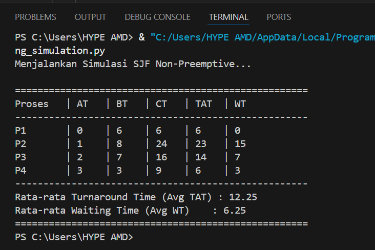

# Laporan Praktikum Minggu [9]
Topik: Simulasi Algoritma Penjadwalan CPU

---

## Identitas
- **Nama**  : Latifah Risti Anggraeni  
- **NIM**   : 250202945
- **Kelas** : 1IKRB

---

## Tujuan
1. Membuat program simulasi algoritma penjadwalan FCFS dan/atau SJF.  
2. Menjalankan program dengan dataset uji yang diberikan atau dibuat sendiri.  
3. Menyajikan output simulasi dalam bentuk tabel atau grafik.  
4. Menjelaskan hasil simulasi secara tertulis.  
5. Mengunggah kode dan laporan ke Git repository dengan rapi dan tepat waktu.

---

## Dasar Teori
1. Penjadwalan CPU (CPU Scheduling)Penjadwalan CPU adalah proses yang menentukan proses mana yang akan menggunakan CPU sementara proses lain dalam status waiting atau ready. Tujuan utamanya adalah memaksimalkan penggunaan CPU (CPU utilization) dan meminimalkan waktu tunggu proses agar sistem berjalan efisien.

2. Algoritma Shortest Job First (SJF)Algoritma SJF memilih proses dengan durasi waktu eksekusi (Burst Time) terpendek untuk dijalankan terlebih dahulu.Non-Preemptive: Dalam varian ini, jika CPU telah dialokasikan ke suatu proses, proses tersebut tidak dapat diinterupsi hingga selesai (finish), meskipun ada proses baru yang datang dengan Burst Time lebih singkat.memiliki keunggulan dalam memberikan Average Waiting Time (rata-rata waktu tunggu) yang minimum dibandingkan algoritma lain.

3. Parameter Penilaian PenjadwalanDalam simulasi ini, terdapat beberapa parameter kunci yang dihitung:
- Arrival Time (AT): Waktu saat proses masuk ke dalam antrean (Ready Queue).
- Burst Time (BT): Waktu yang dibutuhkan proses untuk menyelesaikan eksekusinya di CPU.
- Completion Time (CT): Waktu saat proses benar-benar selesai dieksekusi.
- Turnaround Time (TAT): Selisih antara waktu selesai dengan waktu kedatangan ($TAT = CT - AT$).
- Waiting Time (WT): Selisih antara Turnaround Time dengan Burst Time ($WT = TAT - BT$).

---

## Langkah Praktikum
1. **Menyiapkan Dataset**

   Buat dataset proses minimal berisi:

   | Proses | Arrival Time | Burst Time |
   |:--:|:--:|:--:|
   | P1 | 0 | 6 |
   | P2 | 1 | 8 |
   | P3 | 2 | 7 |
   | P4 | 3 | 3 |

2. **Implementasi Algoritma**

   Program harus:
   - Menghitung *waiting time* dan *turnaround time*.  
   - Mendukung minimal **1 algoritma (FCFS atau SJF non-preemptive)**.  
   - Menampilkan hasil dalam tabel.

3. **Eksekusi & Validasi**

   - Jalankan program menggunakan dataset uji.  
   - Pastikan hasil sesuai dengan perhitungan manual minggu sebelumnya.  
   - Simpan hasil eksekusi (screenshot).

4. **Analisis**

   - Jelaskan alur program.  
   - Bandingkan hasil simulasi dengan perhitungan manual.  
   - Jelaskan kelebihan dan keterbatasan simulasi.

5. **Commit & Push**

   ```bash
   git add .
   git commit -m "Minggu 9 - Simulasi Scheduling CPU"
   git push origin main
   ```

---

## Hasil Eksekusi


---

## Analisis
Berdasarkan data hasil eksekusi program simulasi penjadwalan CPU menggunakan algoritma Shortest Job First (SJF) Non-Preemptive, berikut adalah poin-poin analisisnya:

1. Meskipun P2 datang lebih awal (detik ke-1) daripada P4 (detik ke-3), program tetap memilih P4 untuk dieksekusi segera setelah P1 selesai pada detik ke-6. Hal ini dikarenakan pada saat P1 selesai, P4 memiliki Burst Time terkecil (3) dibandingkan P2 (8) dan P3 (7) yang ada di antrean.

2. Penggunaan algoritma SJF berhasil menekan Waiting Time rata-rata menjadi 6.25. Jika dibandingkan dengan algoritma FCFS pada dataset yang sama, SJF memberikan hasil yang lebih efisien karena meminimalkan efek antrean panjang untuk proses yang pendek.

3. Hasil simulasi yang ditampilkan dalam tabel (CT, TAT, dan WT) memiliki nilai yang identik dengan perhitungan manual yang dilakukan sebelumnya. Hal ini membuktikan bahwa logika algoritma yang diimplementasikan dalam kode Python sudah akurat.

4. Simulasi ini bersifat deterministik dan belum memperhitungkan overhead sistem operasi seperti waktu yang dibutuhkan untuk context switching antar proses.

---

## Kesimpulan
Algoritma SJF Non-Preemptive terbukti sangat efektif dalam menurunkan rata-rata waktu tunggu (Average Waiting Time) dengan mendahulukan proses yang paling cepat selesai.

Pengujian algoritma penjadwalan melalui program simulasi mempermudah validasi teori penjadwalan CPU secara cepat, akurat, dan aman tanpa harus menguji langsung pada kernel sistem operasi.

Program simulasi berbasis terminal yang dibangun telah berhasil memenuhi seluruh ketentuan teknis, mampu membaca dataset dari file CSV, dan menyajikan hasil perhitungan yang akurat sesuai dengan parameter sistem operasi.

---

## Quiz
1. Mengapa simulasi diperlukan untuk menguji algoritma scheduling?

**Jawab:** Simulasi diperlukan untuk menguji efisiensi algoritma secara aman dan cepat tanpa risiko merusak sistem operasi nyata. Selain itu, simulasi memungkinkan pengujian berbagai skenario beban kerja secara berulang untuk mendapatkan hasil yang konsisten.

2. Apa perbedaan hasil simulasi dengan perhitungan manual jika dataset besar?

**Jawab:** Pada dataset besar, perhitungan manual sangat rentan terhadap kesalahan manusia (human error) dan memakan waktu lama. Sebaliknya, simulasi komputer tetap akurat, mampu menangani ribuan data dalam hitungan detik, dan hasilnya mudah divalidasi secara otomatis.

3. Algoritma mana yang lebih mudah diimplementasikan? Jelaskan.

**Jawab:** FCFS (First-Come, First-Served) adalah yang paling mudah diimplementasikan. Hal ini karena logikanya sangat sederhana, yaitu memproses data hanya berdasarkan urutan kedatangan tanpa perlu melakukan penyortiran ulang atau pencarian Burst Time terkecil di tengah proses eksekusi.

---

## Refleksi Diri
Bagian paling menantang minggu ini adalah mengimplementasikan logika pemilihan proses pada algoritma SJF Non-Preemptive, di mana program harus secara dinamis menyortir antrean berdasarkan Burst Time terkecil setiap kali CPU selesai bekerja. Kesulitannya terletak pada sinkronisasi antara waktu kedatangan (Arrival Time) dengan ketersediaan proses di dalam ready queue agar urutan eksekusi tetap akurat.

Cara mengatasinya dengan menerapkan fungsi sortir otomatis pada list antrean sebelum proses berikutnya dipilih untuk dieksekusi. Selain itu, saya melakukan validasi mandiri dengan membandingkan hasil tabel di terminal terhadap perhitungan manual guna memastikan nilai TAT dan WT sudah tepat.

---

**Credit:**  
_Template laporan praktikum Sistem Operasi (SO-202501) – Universitas Putra Bangsa_
